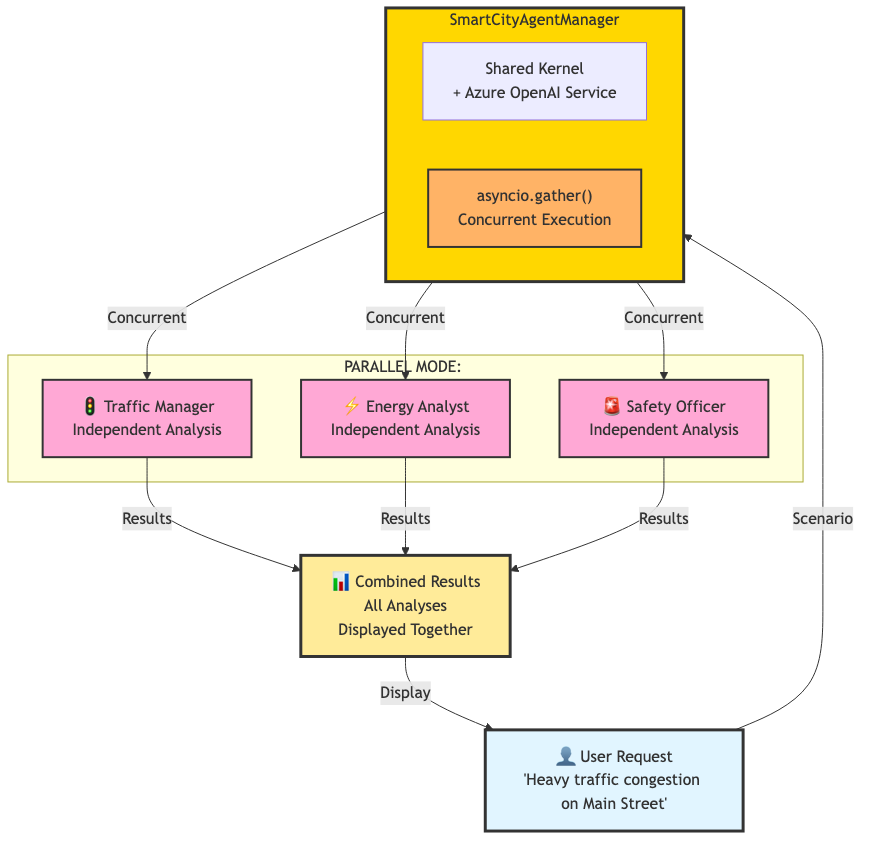
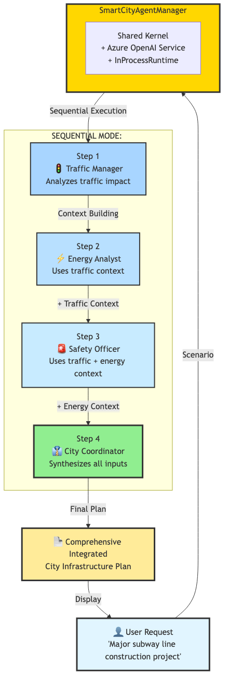

# Smart City Multi-Agent System - Demo

## 🌟 Overview

This demo introduces **multi-agent architecture** using **Semantic Kernel 1.37.0** and **Azure OpenAI**. It demonstrates how specialized AI agents can work together in two fundamental modes:

- **Parallel Mode**: Agents work independently for quick analysis
- **Sequential Mode**: Agents build on each other's context for coordinated planning

---

## 🏗️ System Architecture

### Two Processing Modes

#### 1. Parallel Mode - Independent Analysis



The Parallel mode demonstrates **concurrent execution** where agents work independently:

- All 3 specialist agents (Traffic, Energy, Safety) receive the same scenario
- Uses `asyncio.gather()` for simultaneous execution
- Each agent provides independent analysis
- Results are combined and displayed together

**Best For:** Quick, multi-perspective assessments when agents don't need to share context

---

#### 2. Sequential Mode - Context-Aware Chain



The Sequential mode demonstrates **context building** where each agent receives previous analyses:

- **Step 1**: Traffic Manager analyzes the scenario
- **Step 2**: Energy Analyst receives traffic analysis as context
- **Step 3**: Safety Officer receives both traffic and energy analyses
- **Step 4**: City Coordinator synthesizes all inputs into integrated plan

**Best For:** Complex scenarios requiring coordinated, context-aware planning

---

## 🔧 Critical Code Sections

### 1. Creating Specialized Agents with ChatCompletionAgent
**Location:** `smart_city.py:26-60`

Modern agent creation using Semantic Kernel 1.37.0:

```python
# Shared kernel instance for all agents
self.kernel = Kernel()
self.kernel.add_service(AzureChatCompletion(...))

# Specialized agents with domain expertise
self.agents = {
    "traffic": ChatCompletionAgent(
        kernel=self.kernel,
        name="Traffic_Manager",
        description="Expert in urban traffic flow and congestion management",
        instructions="""You are an expert in urban traffic flow and congestion management.
        Analyze traffic situations, provide insights on congestion patterns, and suggest
        optimization strategies. Be specific and data-driven in your analysis."""
    ),
    ...
}
```

**Why this matters:** This is the foundation of multi-agent systems - creating specialized agents with distinct expertise through `instructions` parameter. All agents share a single kernel for efficiency.

---

### 2. Parallel Execution with asyncio.gather()
**Location:** `smart_city.py:62-82`

Running multiple agents concurrently:

```python
# Create tasks for all agents
tasks = {
    "🚦 Traffic": self._get_agent_response(self.agents["traffic"], scenario),
    "⚡ Energy": self._get_agent_response(self.agents["energy"], scenario),
    "🚨 Safety": self._get_agent_response(self.agents["safety"], scenario)
}

# Execute all analyses in parallel
results = await asyncio.gather(*tasks.values(), return_exceptions=True)
```

**Why this matters:** Shows how to run multiple agents simultaneously for maximum efficiency. `asyncio.gather()` is the key to concurrent multi-agent execution.

---

### 3. Sequential Collaboration with Context Building
**Location:** `smart_city.py:102-149`

Building context through sequential agent calls:

```python
# Step 1: Traffic analysis
traffic_response = await self.agents["traffic"].get_response(scenario)
traffic_content = str(traffic_response.content)

# Step 2: Energy analysis WITH traffic context
energy_prompt = f"""Scenario: {scenario}

Previous Analysis from Traffic Department:
{traffic_content}

Provide energy consumption analysis considering the traffic implications."""

energy_response = await self.agents["energy"].get_response(energy_prompt)
```

**Why this matters:** This is THE key to sequential collaboration - each agent receives accumulated context from all previous agents, enabling coordinated analysis.

---

### 4. Shared Kernel Pattern for Resource Efficiency
**Location:** `smart_city.py:12-24`

Single kernel instance shared across all agents:

```python
# Single shared kernel instance for all agents
self.kernel = Kernel()

# Add Azure service to kernel once
self.kernel.add_service(AzureChatCompletion(...))

# All agents use the same kernel
self.agents = {
    "traffic": ChatCompletionAgent(kernel=self.kernel, ...),
    "energy": ChatCompletionAgent(kernel=self.kernel, ...),
    "safety": ChatCompletionAgent(kernel=self.kernel, ...),
}
```

**Why this matters:** Demonstrates production-ready resource management - one kernel serves all agents rather than creating separate instances. This is crucial for scalability.

---

## 🚀 Quick Start

### 1. Installation
```bash
pip install semantic-kernel==1.37.0 python-dotenv
```

### 2. Azure OpenAI Configuration
Create `.env` file in the repository root:
```env
AZURE_TEXTGENERATOR_DEPLOYMENT_NAME=your-deployment
AZURE_TEXTGENERATOR_DEPLOYMENT_ENDPOINT=https://your-resource.openai.azure.com/
AZURE_TEXTGENERATOR_DEPLOYMENT_KEY=your-api-key
```

### 3. Run the Demo
```bash
cd lesson-1_implementing_multi_agent_architecture_with_python/demo
source ../../.venv/bin/activate
uv run smart_city.py
```

---

## 📊 System Components

### Four Specialized Agents

1. **🚦 Traffic Manager** - Urban traffic flow and congestion management
2. **⚡ Energy Analyst** - Energy consumption and distribution analysis
3. **🚨 Safety Officer** - Public safety and emergency response
4. **👔 City Coordinator** - Cross-departmental coordination and planning

### SmartCityAgentManager

The central orchestration hub that:
- Manages a shared Kernel instance with Azure OpenAI service
- Initializes all 4 specialized ChatCompletionAgent instances
- Implements 2 processing modes (parallel and sequential)
- Handles runtime lifecycle with InProcessRuntime

---

## 💡 Mode Comparison

| Mode | Best For | Context Sharing | Performance | Use Case |
|------|----------|----------------|-------------|----------|
| **Parallel** | Quick assessments | 🔴 Independent | 🟢 Fastest | Multi-perspective analysis |
| **Sequential** | Complex planning | 🟢 Full context | 🟡 Medium | Coordinated city planning |

---

## 📝 Example Output

### Parallel Mode Output
```
📋 Scenario 1: Parallel Agent Analysis
🔍 Analyzing: Heavy traffic congestion on Main Street...
--------------------------------------------------
🚦 Traffic:
[Detailed traffic flow analysis with optimization strategies]

⚡ Energy:
[Energy consumption patterns and efficiency recommendations]

🚨 Safety:
[Risk assessment and public safety measures]
```

### Sequential Mode Output
```
🚀 Starting Optimized Multi-Agent Collaboration
============================================================
1. 🚦 Traffic Analysis Starting...
   Traffic Analysis Complete: 245 characters

2. ⚡ Energy Analysis Starting...
   Energy Analysis Complete: 198 characters

3. 🚨 Safety Analysis Starting...
   Safety Analysis Complete: 312 characters

4. 📋 Generating Integrated Summary...
🎯 Sequential Collaboration Completed!
```

**Notice:** In sequential mode, each step builds on previous analyses - the coordinator has access to all departmental inputs.

---

## 🎯 Key Learning Points

### Multi-Agent Fundamentals
- **Specialized Agents**: Each agent has specific domain expertise through tailored instructions
- **Shared Resources**: Single kernel serves all agents for optimal performance
- **Modern Framework**: Uses latest Semantic Kernel 1.37.0 ChatCompletionAgent API

### Processing Patterns
- **Parallel**: Independent concurrent execution with `asyncio.gather()`
- **Sequential**: Context-aware chain where each agent builds on previous work
- **Flexible Architecture**: Choose the right mode based on scenario requirements

### Production Best Practices
- **Error Handling**: Comprehensive exception management with `return_exceptions=True`
- **Resource Management**: Shared kernel and proper runtime lifecycle
- **Type Safety**: Proper ChatMessageContent handling with string conversion

---

## 🔄 When to Use Each Mode

### Use Parallel Mode When:
- Need quick, multi-perspective analysis
- Agents can work independently without context
- Speed is more important than coordination
- Example: "Assess traffic, energy, and safety for Main Street congestion"

### Use Sequential Mode When:
- Complex scenarios requiring coordinated planning
- Later decisions depend on earlier analyses
- Context sharing improves recommendation quality
- Example: "Plan major subway construction considering all city departments"

---

## 📖 Learn More

For more information about Semantic Kernel and multi-agent systems, visit:
- [Semantic Kernel Documentation](https://learn.microsoft.com/en-us/semantic-kernel/)
- [Azure OpenAI Service](https://azure.microsoft.com/en-us/products/ai-services/openai-service)