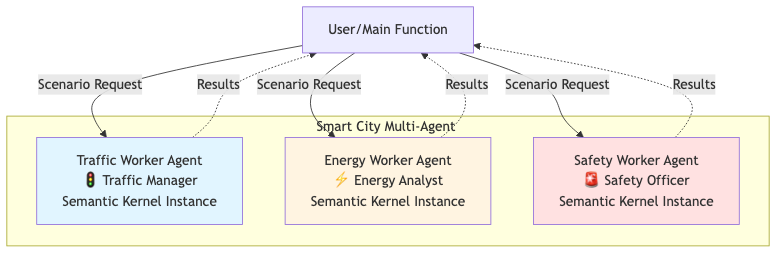

# 🏙️ Smart City Multi-Agent System (Semantic Kernel 1.37.0)

## 📖 Overview

This project demonstrates an **advanced multi-agent smart city management system** built using **Semantic Kernel 1.37.0** and **Azure OpenAI Foundry**. 

The system showcases how specialized AI agents can collaborate to analyze complex urban scenarios, featuring both **parallel independent analysis** and **sequential collaborative planning**.

---

## 🏗️ System Architecture



The system implements a sophisticated multi-agent architecture:

- **SmartCityAgentManager** orchestrates all agent interactions
- **Four Specialized Agents** with distinct expertise areas
- **Shared Kernel Instance** for efficient resource management
- **Dual Processing Modes**: Parallel analysis & sequential collaboration
- **Azure OpenAI Foundry Integration** for all AI services

### Agent Specializations:

- **🚦 Traffic Manager**: Urban traffic flow and congestion management
- **⚡ Energy Analyst**: Energy consumption and distribution analysis  
- **🚨 Safety Officer**: Public safety and emergency response
- **👔 City Coordinator**: Cross-departmental coordination and planning

---

## 🤖 Agent Framework Features

### 🔹 Modern Semantic Kernel 1.37.0
- Uses latest `ChatCompletionAgent` class
- Implements proper `InProcessRuntime` management
- Leverages Azure OpenAI Foundry for all agents
- Optimized with shared kernel instance

### 🔹 Dual Processing Modes

#### 1. **Parallel Analysis**
- All agents analyze scenarios simultaneously using `asyncio.gather()`
- Independent processing for efficiency
- Perfect for quick, multi-perspective assessments

#### 2. **Sequential Collaboration**
- Agents build on each other's analyses
- Context-aware processing chain
- Ideal for complex, interconnected scenarios

---

## ⚙️ How It Works

### 1. **Environment Configuration**

Loads Azure OpenAI Foundry credentials from `.env`:

```env
AZURE_TEXTGENERATOR_DEPLOYMENT_NAME=your-foundry-deployment
AZURE_TEXTGENERATOR_DEPLOYMENT_ENDPOINT=https://your-resource.openai.azure.com/
AZURE_TEXTGENERATOR_DEPLOYMENT_KEY=your-api-key
```

### 2. **Agent Initialization**

```python
# Shared kernel with Azure Foundry service
self.kernel = Kernel()
self.kernel.add_service(AzureChatCompletion(...))

# Specialized agents with domain expertise
self.traffic_agent = ChatCompletionAgent(
    name="Traffic_Manager",
    description="Expert in urban traffic flow and congestion management",
    instructions="Traffic analysis instructions..."
)
```

### 3. **Scenario Processing Pipeline**

#### Parallel Analysis Flow:
```
User Scenario → All Agents (Parallel) → Consolidated Results
```

#### Sequential Collaboration Flow:
```
Scenario → Traffic → Energy → Safety → Coordinator → Integrated Plan
```

### 4. **Advanced Features**

- **Error Resilience**: Comprehensive exception handling
- **Resource Optimization**: Single kernel instance with shared services
- **Type Safety**: Proper ChatMessageContent handling
- **Performance Monitoring**: Response length tracking and timing

---

## 🛠️ Running the System

### Prerequisites

```bash
pip install semantic-kernel==1.37.0 python-dotenv
```

### Execution

```bash
python smart_city_agents.py
```

### Sample Scenarios

The system processes multiple urban scenarios:

1. **Traffic Congestion Analysis**
2. **Residential Development Planning**  
3. **Major Infrastructure Projects** (subway construction, etc.)

---

## 📊 Sample Output

```text
🏙️ Smart City Multi-Agent System - Semantic Kernel 1.37.0
Optimized with Parallel Processing & Sequential Collaboration
============================================================

📋 Scenario 1: Parallel Agent Analysis
🔍 Analyzing: Heavy traffic congestion on Main Street...
--------------------------------------------------
🚦 Traffic:
[Detailed traffic flow analysis with optimization strategies]

⚡ Energy: 
[Energy consumption patterns and efficiency recommendations]

🚨 Safety:
[Risk assessment and public safety measures]

🚀 Starting Optimized Multi-Agent Collaboration
============================================================
🤖 Starting Sequential Collaboration
1. 🚦 Traffic Analysis Starting...
   Traffic Analysis Complete: 245 characters

2. ⚡ Energy Analysis Starting...
   Energy Analysis Complete: 198 characters

3. 🚨 Safety Analysis Starting... 
   Safety Analysis Complete: 312 characters

4. 📋 Generating Integrated Summary...
🎯 Sequential Collaboration Completed!

Final Integrated Summary:
[Comprehensive city plan with prioritized recommendations]
============================================================
✅ Demo completed successfully!
```

---

## 🎯 Key Technical Achievements

### 🚀 **Performance Optimizations**
- **Parallel Processing**: Concurrent agent execution using `asyncio.gather()`
- **Resource Sharing**: Single kernel instance across all agents
- **Efficient Runtime**: Proper `InProcessRuntime` lifecycle management

### 🔧 **Code Quality**
- **Type Safety**: Robust ChatMessageContent handling
- **Error Resilience**: Comprehensive exception handling
- **Maintainability**: Clean separation of concerns and modular design

### 🤖 **Advanced Agent Patterns**
- **Context-Aware Collaboration**: Sequential processing with shared context
- **Domain Specialization**: Expert agents with tailored instructions
- **Integrated Planning**: Coordinator agent for synthesis and summary

---

## 🔮 Extension Opportunities

### 🎭 **Additional Specialized Agents**
- **EnvironmentMonitor**: Air quality and pollution analysis
- **HealthcareCoordinator**: Public health and medical services
- **TransitPlanner**: Public transportation and mobility solutions

### 🔗 **Advanced Integration**
- **Real-time Data Feeds**: Live traffic, energy, and safety data
- **IoT Sensor Networks**: Smart city sensor integration
- **Citizen Feedback**: Public input and reporting systems

### 🧠 **Intelligent Orchestration**
- **Dynamic Agent Selection**: AI-powered routing to relevant specialists
- **Priority-based Processing**: Emergency scenario prioritization
- **Learning Systems**: Agent performance improvement over time

---

## ⚠️ Important Notes

### **Semantic Kernel 1.37.0 Compatibility**
- Uses modern `ChatCompletionAgent` instead of deprecated classes
- Implements proper runtime management patterns
- Handles latest content type systems

### **Azure OpenAI Foundry**
- All agents use Azure Foundry services
- Consistent authentication and configuration
- Enterprise-grade AI capabilities

---

## 📚 Learning Outcomes

- **Modern Agent Framework**: Latest Semantic Kernel agent APIs and patterns
- **Advanced Async Programming**: Sophisticated parallel and sequential workflows
- **Production-Ready Architecture**: Error handling, resource management, and scalability
- **AI Orchestration**: Intelligent multi-agent collaboration strategies
- **Azure Integration**: Enterprise AI service configuration and optimization

---

✨ **This project demonstrates production-ready multi-agent systems using the latest Semantic Kernel frameworks and Azure OpenAI Foundry services, providing a foundation for intelligent urban management solutions.**