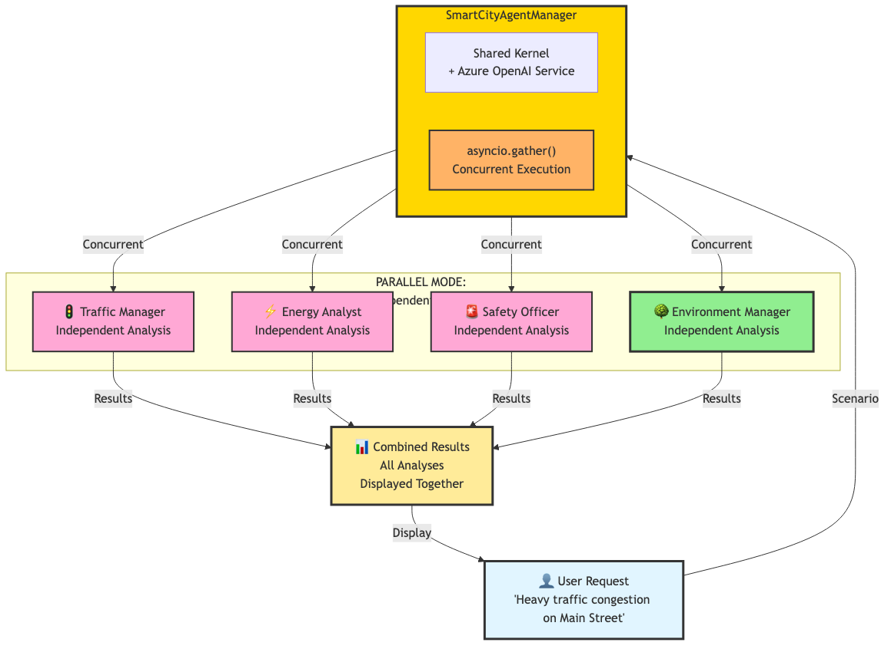
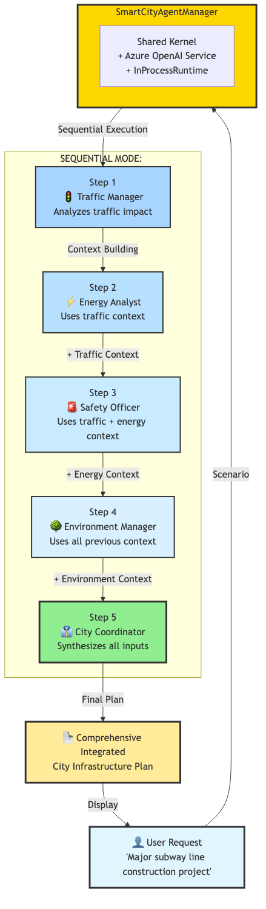

# Smart City Multi-Agent System - Complete Solution

## 🌟 Overview

This solution **extends the demo** with a fifth specialized agent - the **Environment Manager** - demonstrating how to expand multi-agent systems with additional domain expertise. It maintains the same dual-mode architecture (parallel and sequential) while adding comprehensive environmental analysis capabilities.

**Key Enhancement Over Demo:**
- **Five Specialized Agents** (added Environment Manager for sustainability analysis)
- **Extended Sequential Workflow** (5 steps instead of 4)
- **Expanded Parallel Analysis** (4 specialist agents instead of 3)
- **Comprehensive City Planning** (includes environmental impact assessment)

---

## 🏗️ System Architecture

### Two Processing Modes

#### 1. Parallel Mode - Independent Analysis



The Parallel mode now includes **four specialist agents** (Traffic, Energy, Safety, Environment) working independently:

- All 4 specialist agents receive the same scenario
- Uses `asyncio.gather()` for simultaneous execution
- Each agent provides independent analysis including environmental impact
- Results are combined and displayed together

**Enhancement:** Adds Environment Manager to the parallel execution for comprehensive coverage.

---

#### 2. Sequential Mode - Context-Aware Chain



The Sequential mode demonstrates **5-step context building** where each agent receives previous analyses:

- **Step 1**: Traffic Manager analyzes the scenario
- **Step 2**: Energy Analyst receives traffic analysis as context
- **Step 3**: Safety Officer receives both traffic and energy analyses
- **Step 4**: **Environment Manager** receives traffic, energy, and safety analyses (NEW)
- **Step 5**: City Coordinator synthesizes all four departmental inputs

**Enhancement:** Adds environmental analysis step before final coordination, enabling more comprehensive planning.

---

## 🔧 Critical Code Sections

### 1. Five Specialized Agents - Adding Environment Manager
**Location:** `smart_city_solution.py:27-69`

Extending the agent ecosystem with environmental expertise:

```python
self.agents = {
    "traffic": ChatCompletionAgent(
        kernel=self.kernel,
        name="Traffic_Manager",
        description="Expert in urban traffic flow and congestion management",
        instructions="""You are an expert in urban traffic flow and congestion management..."""
    ),
    "energy": ChatCompletionAgent(...),
    "safety": ChatCompletionAgent(...),
    "environment": ChatCompletionAgent(  # NEW AGENT
        kernel=self.kernel,
        name="Environment_Manager",
        description="Expert in environmental impact and sustainability",
        instructions="""You are an expert in environmental impact assessment and sustainability.
        Analyze environmental situations, identify ecological risks, and recommend
        sustainable solutions. Focus on pollution control, green initiatives, and
        long-term environmental health."""
    ),
    "coordinator": ChatCompletionAgent(...)
}
```

**Why this matters:** Shows how to extend multi-agent systems with new domain experts. The Environment Manager adds critical sustainability perspective that wasn't in the demo's 4-agent system.

---

### 2. Parallel Execution with Four Agents
**Location:** `smart_city_solution.py:76-82`

Including Environment Manager in concurrent analysis:

```python
# Create tasks for all agents including environment agent
tasks = {
    "🚦 Traffic": self._get_agent_response(self.agents["traffic"], scenario),
    "⚡ Energy": self._get_agent_response(self.agents["energy"], scenario),
    "🚨 Safety": self._get_agent_response(self.agents["safety"], scenario),
    "🌳 Environment": self._get_agent_response(self.agents["environment"], scenario)  # NEW
}

# Execute all analyses in parallel
results = await asyncio.gather(*tasks.values(), return_exceptions=True)
```

**Why this matters:** Demonstrates how adding a new agent to parallel mode is as simple as adding one more task to the `asyncio.gather()` execution. The same concurrent execution pattern scales effortlessly from 3 to 4 agents.

---

### 3. Step 4: Environmental Context Building
**Location:** `smart_city_solution.py:141-158`

The new environmental analysis step with full context:

```python
# Step 4: Environmental analysis (with all previous context)
print("4. 🌳 Environmental Analysis Starting...")
environment_prompt = f"""Scenario: {complex_scenario}

Traffic Department Analysis:
{traffic_content}

Energy Department Analysis:
{energy_content}

Safety Department Analysis:
{safety_content}

Provide comprehensive environmental impact assessment considering all previous analyses."""

environment_response = await self.agents["environment"].get_response(environment_prompt)
environment_content = str(environment_response.content)
print(f"Environmental Analysis Complete: {len(environment_content)} characters\n")
```

**Why this matters:** This is THE key enhancement - the Environment Manager receives accumulated context from Traffic, Energy, and Safety departments, enabling comprehensive environmental impact assessment that considers all operational aspects.

---

### 4. Extended Coordinator Integration
**Location:** `smart_city_solution.py:160-184`

Coordinator now synthesizes five departmental inputs:

```python
# Step 5: Generate integrated summary
summary_prompt = f"""Based on all departmental analyses, create a comprehensive summary:

TRAFFIC ANALYSIS:
{traffic_content}

ENERGY ANALYSIS:
{energy_content}

SAFETY ANALYSIS:
{safety_content}

ENVIRONMENTAL ANALYSIS:  # NEW CONTEXT
{environment_content}

Provide a concise integrated summary with key recommendations and priorities."""

summary_response = await self.agents["coordinator"].get_response(summary_prompt)
```

**Why this matters:** Shows how the final coordinator step scales to incorporate additional departmental inputs. The City Coordinator now has environmental perspective alongside traffic, energy, and safety analyses for truly comprehensive urban planning.

---

## 🚀 Quick Start

### 1. Installation
```bash
pip install semantic-kernel==1.37.0 python-dotenv
```

### 2. Azure OpenAI Configuration
Create `.env` file in the repository root:
```env
AZURE_DEPLOYMENT_NAME=your-deployment
AZURE_DEPLOYMENT_ENDPOINT=https://your-resource.openai.azure.com/
AZURE_DEPLOYMENT_KEY=your-api-key
```

### 3. Run the Solution
```bash
cd lesson-1_implementing_multi_agent_architecture_with_python/exercises/solution
source ../../../.venv/bin/activate
uv run smart_city_solution.py
```

---

## 📊 System Components

### Five Specialized Agents

1. **🚦 Traffic Manager** - Urban traffic flow and congestion management
2. **⚡ Energy Analyst** - Energy consumption and distribution analysis
3. **🚨 Safety Officer** - Public safety and emergency response
4. **🌳 Environment Manager** - Environmental impact and sustainability (NEW)
5. **👔 City Coordinator** - Cross-departmental coordination and planning

### SmartCityAgentManager

The central orchestration hub that:
- Manages a shared Kernel instance with Azure OpenAI service
- Initializes all 5 specialized ChatCompletionAgent instances
- Implements 2 processing modes (parallel and sequential)
- Handles runtime lifecycle with InProcessRuntime

---

## 💡 Mode Comparison

| Mode | Agents | Context Sharing | Steps | Use Case |
|------|--------|----------------|-------|----------|
| **Parallel** | 4 specialists | 🔴 Independent | 1 | Multi-perspective analysis with environmental impact |
| **Sequential** | 5 total (4 + coordinator) | 🟢 Full context | 5 | Coordinated planning with environmental considerations |

**Key Difference from Demo:** Sequential mode has 5 steps instead of 4, with environmental analysis integrated before final coordination.

---

## 📝 Example Output

### Parallel Mode Output
```
📋 Scenario 1: Parallel Agent Analysis
🔍 Analyzing: Heavy traffic congestion on Main Street...
--------------------------------------------------
🚦 Traffic:
[Traffic flow analysis with optimization strategies]

⚡ Energy:
[Energy consumption patterns and efficiency recommendations]

🚨 Safety:
[Risk assessment and public safety measures]

🌳 Environment:  # NEW
[Environmental impact analysis with sustainability recommendations]
```

### Sequential Mode Output
```
🚀 Starting Complete Multi-Agent Collaboration
============================================================
1. 🚦 Traffic Analysis Starting...
   Traffic Analysis Complete: 4225 characters

2. ⚡ Energy Analysis Starting...
   Energy Analysis Complete: 4888 characters

3. 🚨 Safety Analysis Starting...
   Safety Analysis Complete: 5583 characters

4. 🌳 Environmental Analysis Starting...  # NEW STEP
   Environmental Analysis Complete: 5287 characters

5. 📋 Generating Integrated Summary...
🎯 Sequential Collaboration Completed!

Final Integrated Summary:
[Comprehensive city plan with environmental priorities integrated]
```

**Notice:** Environmental analysis step (Step 4) has access to all previous departmental analyses, enabling comprehensive sustainability assessment.

---

## 🎯 Key Learning Points

### Extending Multi-Agent Systems
- **Adding New Agents**: Shows how to extend existing multi-agent architecture with new domain experts
- **Scalable Patterns**: Same orchestration patterns (parallel, sequential) work seamlessly with more agents
- **Context Propagation**: New agents integrate into sequential workflows and receive accumulated context

### Enhanced Coverage
- **Comprehensive Analysis**: Environmental perspective complements traffic, energy, and safety analyses
- **Integrated Planning**: City Coordinator synthesizes five departmental inputs for holistic urban planning
- **Sustainability Focus**: Environment Manager brings critical long-term perspective to infrastructure decisions

### Production Best Practices
- **Shared Resources**: Same kernel serves all 5 agents for optimal performance
- **Error Handling**: Comprehensive exception management with `return_exceptions=True`
- **Modern Framework**: Uses latest Semantic Kernel 1.37.0 ChatCompletionAgent API

---

## 🔄 When to Use Each Mode

### Use Parallel Mode When:
- Need quick, multi-perspective analysis including environmental impact
- Agents can work independently without context
- Speed is more important than coordination
- Example: "Assess traffic, energy, safety, and environmental impact for Main Street congestion"

### Use Sequential Mode When:
- Complex scenarios requiring coordinated planning with environmental considerations
- Later decisions depend on earlier analyses
- Context sharing improves recommendation quality
- Example: "Plan major subway construction considering all city departments including environmental impact"

---

## 📖 Learn More

For more information about Semantic Kernel and multi-agent systems, visit:
- [Semantic Kernel Documentation](https://learn.microsoft.com/en-us/semantic-kernel/)
- [Azure OpenAI Service](https://azure.microsoft.com/en-us/products/ai-services/openai-service)