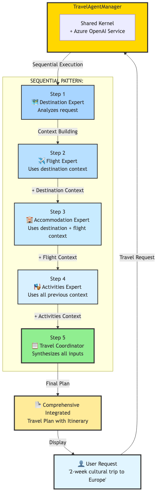
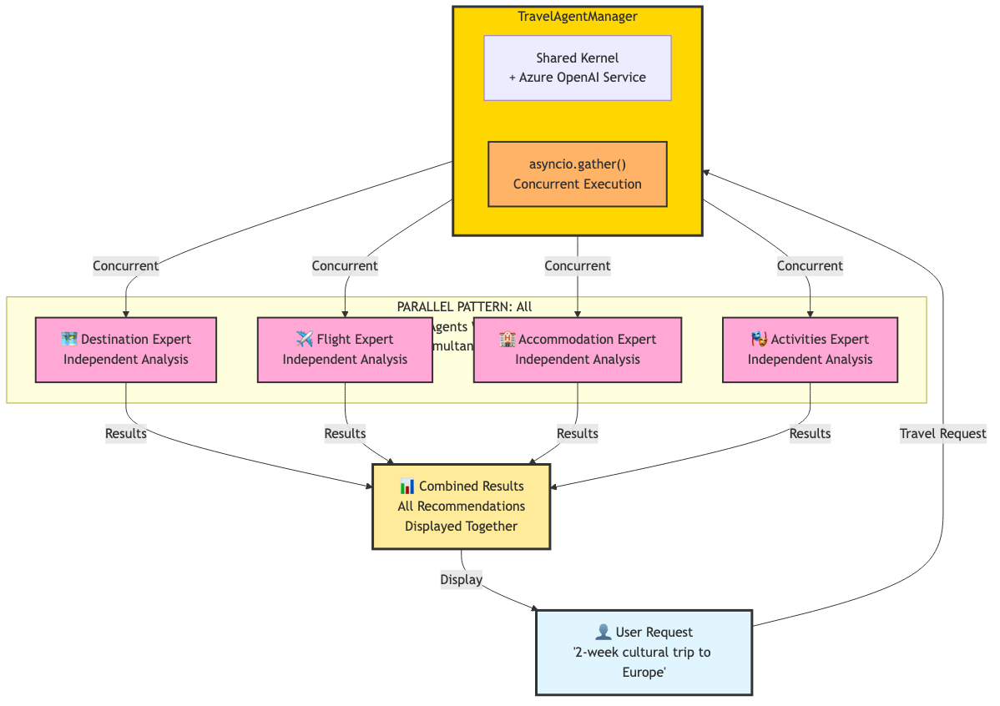
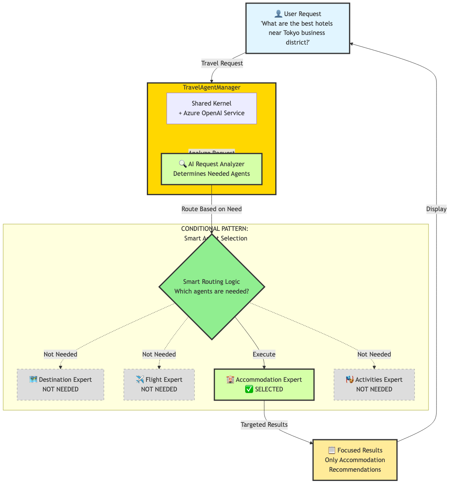

# Modern Travel Agent Orchestration - Multi-Agent System Demo

## 🌟 Overview

A professional demo showcasing advanced multi-agent orchestration patterns for intelligent travel planning using **Semantic Kernel 1.37.0** and **Azure OpenAI**:

- **Sequential Pattern**: Context-aware chain where agents build on each other's work
- **Parallel Pattern**: Maximum efficiency with all agents working simultaneously
- **Conditional Pattern**: AI-powered intelligent agent selection

## 🎯 What You'll Learn

- Modern Semantic Kernel 1.37.0 agent framework patterns
- Advanced orchestration strategies for complex workflows
- Context-aware sequential processing between agents
- Intelligent agent selection using AI analysis
- Production-ready multi-agent system architecture

---

## 🏗️ System Architecture

### Three Orchestration Patterns

#### 1. Sequential Pattern - Context-Aware Chain



The Sequential pattern demonstrates **progressive context building** where each agent receives the accumulated knowledge from all previous agents:

- **Step 1**: Destination Expert analyzes the travel request
- **Step 2**: Flight Expert receives destination context and provides flight options
- **Step 3**: Accommodation Expert uses both destination and flight context
- **Step 4**: Activities Expert has full context from all previous steps
- **Step 5**: Travel Coordinator synthesizes everything into an integrated plan

**Best For:** Complex multi-step planning where later decisions depend on earlier recommendations

---

#### 2. Parallel Pattern - Maximum Efficiency



The Parallel pattern demonstrates **concurrent execution** where all agents work simultaneously:

- All 4 specialist agents receive the same request at once
- Uses `asyncio.gather()` for concurrent execution
- No context sharing between agents
- Results are combined and displayed together

**Best For:** Quick comprehensive overview and initial research when agents can work independently

---

#### 3. Conditional Pattern - Smart Agent Selection



The Conditional pattern demonstrates **intelligent routing** where only relevant agents are activated:

- AI Analyzer determines which specialists are needed based on request keywords
- Only required agents are executed (resource optimization)
- Unneeded agents are skipped
- Focused, targeted responses

**Best For:** Specific, focused requests where only certain expertise is needed

---

## 🚀 Quick Start

### 1. Installation
```bash
pip install semantic-kernel==1.37.0 python-dotenv
```

### 2. Azure OpenAI Configuration
Create `.env` file in the repository root:
```env
AZURE_DEPLOYMENT_NAME=your-deployment
AZURE_DEPLOYMENT_ENDPOINT=https://your-resource.openai.azure.com/
AZURE_DEPLOYMENT_KEY=your-api-key
```

### 3. Run the Demo
```bash
cd lesson-2_implementing_agent_orchestration/demo
source ../../.venv/bin/activate
uv run travel_planning_demo.py
```

---

## 📊 System Components

### Five Specialist Agents

1. **🗺️ Destination Expert** - Cultural, seasonal, and budget-appropriate destination recommendations
2. **✈️ Flight Expert** - Travel logistics, airlines, routes, and booking strategies
3. **🏨 Accommodation Expert** - Lodging options, locations, and value recommendations
4. **🎭 Activities Expert** - Tours, experiences, and local immersion opportunities
5. **📋 Travel Coordinator** - Integrated planning and comprehensive itinerary synthesis

### TravelAgentManager

The central orchestration hub that:
- Manages a shared Kernel instance with Azure OpenAI service
- Initializes all 5 specialized ChatCompletionAgent instances
- Implements 3 orchestration patterns (sequential, parallel, conditional)
- Handles runtime lifecycle with InProcessRuntime

---

## 💡 Pattern Comparison

| Pattern | Best For | Context Sharing | Performance | Resource Usage |
|---------|----------|----------------|-------------|----------------|
| **Sequential** | Complex multi-step planning | 🟢 Full context accumulation | 🟡 Medium | 🟡 Medium |
| **Parallel** | Quick comprehensive overview | 🔴 Independent | 🟢 Fastest | 🟡 Medium |
| **Conditional** | Specific, focused requests | 🟡 Selective | 🟢 Efficient | 🟢 Optimized |

---

## 🔧 Critical Code Sections

### 1. Agent Definitions with Specialized Instructions
**Location:** `travel_planning_demo.py:29-44`

Each agent is configured with specialized instructions that define its expertise:

```python
self.agents = {
    "destination": ChatCompletionAgent(
        kernel=self.kernel,
        name="Destination_Expert",
        description="Specialist in travel destination recommendations",
        instructions="""You are an expert travel destination specialist.
        Recommend 2-3 perfect destinations based on travel preferences.
        ...
```

**Why this matters:** The `instructions` parameter is what makes each agent an "expert" in its domain. This is the foundation of multi-agent specialization.

---

### 2. Sequential Pattern - Context Building
**Location:** `travel_planning_demo.py:134-139`

Each agent receives accumulated context from all previous agents:

```python
flight_prompt = f"""Original Request: {travel_request}

Destination Analysis:
{dest_content}

Provide flight recommendations considering these destinations."""
```

**Why this matters:** This is THE key to sequential orchestration - progressive context accumulation enables intelligent, coordinated recommendations.

---

### 3. Parallel Pattern - Concurrent Execution
**Location:** `travel_planning_demo.py:224-232`

All agents execute simultaneously using asyncio:

```python
tasks = {
    "destination": self._get_agent_response(self.agents["destination"], travel_request, "🗺️ Destination"),
    "flights": self._get_agent_response(self.agents["flights"], travel_request, "✈️ Flights"),
    ...
}
results = await asyncio.gather(*tasks.values(), return_exceptions=True)
```

**Why this matters:** `asyncio.gather()` enables true concurrent execution for maximum speed - completely different from sequential's step-by-step approach.

---

### 4. Conditional Pattern - Smart Routing Logic
**Location:** `travel_planning_demo.py:283-304`

Intelligent agent selection based on request analysis:

```python
needs_destination = any(phrase in request_lower for phrase in [
    'where should', 'recommend destination', 'place to visit', ...
])

needs_flights = any(phrase in request_lower for phrase in [
    'flight', 'fly', 'airline', ...
])
```

**Why this matters:** Demonstrates intelligent resource optimization - only activate agents that are actually needed for the specific request.

---

## 📝 Example Output

### Sequential Pattern Output

```
🚀 Starting SEQUENTIAL Orchestration
Pattern: Destination → Flights → Accommodation → Activities → Coordinator
------------------------------------------------------------
1. 🗺️ Consulting Destination Expert...
   ✓ Destination analysis complete: 2980 characters
2. ✈️ Consulting Flight Expert...
   ✓ Flight analysis complete: 3857 characters
3. 🏨 Consulting Accommodation Expert...
   ✓ Accommodation analysis complete: 4953 characters
4. 🎭 Consulting Activities Expert...
   ✓ Activities analysis complete: 4645 characters
5. 📋 Generating Integrated Travel Plan...
   ✓ Integrated plan complete: 5303 characters
```

**Notice:** The character counts show progressive context building - the coordinator has the most context (5303 characters) because it receives inputs from all previous agents.

---

## 🎓 Educational Value

This demo provides:

- Clear demonstration of modern multi-agent patterns
- Real-world travel planning use cases
- Progressive complexity from basic to advanced orchestration
- Best practices for enterprise AI system design
- Production-ready error handling and lifecycle management

---

## 🛠️ Technical Features

### Modern Semantic Kernel 1.37.0
- `ChatCompletionAgent` with proper descriptions and instructions
- Shared kernel instance for optimal resource usage
- Azure OpenAI enterprise AI services
- Proper runtime lifecycle management with `InProcessRuntime`

### Production-Ready Architecture
- Comprehensive error handling and graceful degradation
- Performance optimization with concurrent execution
- Scalable design for adding new specialist agents
- Professional logging and progress tracking

---

## 📚 When to Use Each Pattern

### Use Sequential Pattern When:
- Planning complex, multi-destination trips
- Later decisions depend on earlier recommendations
- You need integrated, context-aware planning
- Example: "2-week European cultural tour with specific interests"

### Use Parallel Pattern When:
- You want fastest possible comprehensive overview
- Conducting initial research and brainstorming
- Agents can work independently without context sharing
- Example: "Quick ideas for a beach vacation"

### Use Conditional Pattern When:
- Requests are highly specific and focused
- You want to optimize resource usage
- Some specialist expertise isn't relevant
- Example: "Just need flight options for existing trip plan"

---

## 📖 Learn More

For more information about Semantic Kernel and multi-agent systems, visit:
- [Semantic Kernel Documentation](https://learn.microsoft.com/en-us/semantic-kernel/)
- [Azure OpenAI Service](https://azure.microsoft.com/en-us/products/ai-services/openai-service)