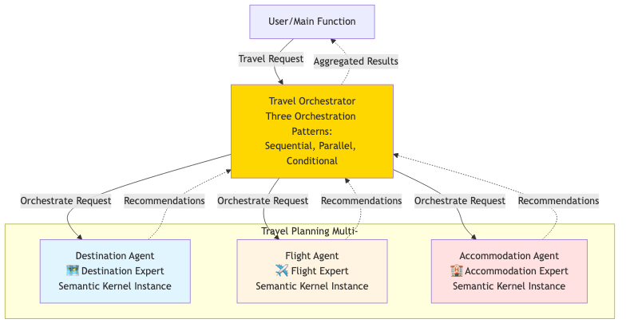

# Modern Travel Agent Orchestration - Multi-Agent System Demo

## 🌟 Overview

A professional demo showcasing advanced multi-agent orchestration patterns for intelligent travel planning using **Semantic Kernel 1.37.0** and **Azure OpenAI Foundry**:

- **Sequential Pattern**: Context-aware chain where agents build on each other's work
- **Parallel Pattern**: Maximum efficiency with all agents working simultaneously  
- **Conditional Pattern**: AI-powered intelligent agent selection
- **Integrated Planning**: Coordinator agent synthesizes comprehensive travel plans

## 🎯 What You'll Learn

- Modern Semantic Kernel 1.37.0 agent framework patterns
- Advanced orchestration strategies for complex workflows
- Context-aware sequential processing between agents
- Intelligent agent selection using AI analysis
- Production-ready multi-agent system architecture

---

## 🏗️ Enhanced System Architecture



The diagram illustrates the advanced travel planning system with **five specialized agents** coordinated through sophisticated orchestration patterns using Azure OpenAI Foundry.

### Five Specialist Agents

1. **🗺️ Destination Expert** - Cultural, seasonal, and budget-appropriate destination recommendations
2. **✈️ Flight Expert** - Travel logistics, airlines, routes, and booking strategies  
3. **🏨 Accommodation Expert** - Lodging options, locations, and value recommendations
4. **🎭 Activities Expert** - Tours, experiences, and local immersion opportunities
5. **📋 Travel Coordinator** - Integrated planning and comprehensive itinerary synthesis

### Advanced Orchestration Patterns

#### 1. **Sequential Pattern** (Context-Aware Chain)
```
Request → Destination → Flights → Accommodation → Activities → Coordinator
```
- Each agent receives context from previous analyses
- Progressive refinement of travel plan
- Ideal for complex, multi-faceted trip planning

#### 2. **Parallel Pattern** (Maximum Efficiency)  
```
Request → [All Agents Simultaneously] → Consolidated Results
```
- All specialists work concurrently using `asyncio.gather()`
- Fastest response time for comprehensive overview
- Perfect for initial trip research and brainstorming

#### 3. **Conditional Pattern** (Intelligent Routing)
```
Request → AI Analysis → [Only Relevant Agents] → Tailored Results
```
- AI-powered request analysis determines needed specialists
- Resource optimization and focused responses
- Smart adaptation to specific user needs

## 🚀 Quick Start

### 1. Installation
```bash
pip install semantic-kernel==1.37.0 python-dotenv
```

### 2. Azure OpenAI Foundry Configuration
Create `.env` file:
```env
AZURE_TEXTGENERATOR_DEPLOYMENT_NAME=your-foundry-deployment
AZURE_TEXTGENERATOR_DEPLOYMENT_ENDPOINT=https://your-resource.openai.azure.com/
AZURE_TEXTGENERATOR_DEPLOYMENT_KEY=your-api-key
```

### 3. Run the Enhanced Demo
```bash
python travel_agent_orchestration.py
```

## 📊 How It Works

### 1. **Modern System Architecture**
- **Shared Kernel Instance**: Single Azure OpenAI Foundry service for all agents
- **ChatCompletionAgent Framework**: Latest Semantic Kernel 1.37.0 agent patterns
- **Runtime Management**: Proper `InProcessRuntime` lifecycle handling
- **Error Resilience**: Comprehensive exception handling and graceful degradation

### 2. **Advanced Pattern Execution**

#### **Sequential Pattern** (Context-Aware Processing):
```python
# Each step builds on previous analyses
destination_analysis = await destination_agent(request)
flight_analysis = await flight_agent(request + destination_context)  
accommodation_analysis = await accommodation_agent(request + destination + flight_context)
activities_analysis = await activities_agent(request + all_previous_context)
integrated_plan = await coordinator(all_analyses)
```

#### **Parallel Pattern** (Concurrent Efficiency):
```python
# All agents execute simultaneously
tasks = {
    "destination": destination_agent(request),
    "flights": flight_agent(request),
    "accommodation": accommodation_agent(request),
    "activities": activities_agent(request)
}
results = await asyncio.gather(*tasks.values())
```

#### **Conditional Pattern** (AI-Powered Routing):
```python
# Intelligent agent selection
analysis = await ai_analyze_request(request)
needs_destination = "where to go" in request_context
needs_flights = "travel logistics" in request_context
needs_accommodation = "where to stay" in request_context  
needs_activities = "things to do" in request_context
# Execute only relevant agents
```

### 3. **Professional Results Display**
- Structured output with clear section separation
- Response length tracking and performance metrics
- Professional emoji-based visual organization
- Consolidated integrated summaries from coordinator

## 🎪 Enhanced Demo Output

```
🌍 TRAVEL AGENT ORCHESTRATION DEMO
Semantic Kernel 1.37.0 - Modern Multi-Agent Patterns
======================================================================

📝 SCENARIO 1: 2-week cultural trip to Europe, history & cuisine, mid-range budget
======================================================================

🔧 Testing SEQUENTIAL Pattern:
======================================================================
🚀 Starting SEQUENTIAL Orchestration
Pattern: Destination → Flights → Accommodation → Activities → Coordinator
----------------------------------------------------------------------
1. 🗺️ Consulting Destination Expert...
   ✓ Destination analysis complete: 245 characters
2. ✈️ Consulting Flight Expert...
   ✓ Flight analysis complete: 198 characters  
3. 🏨 Consulting Accommodation Expert...
   ✓ Accommodation analysis complete: 187 characters
4. 🎭 Consulting Activities Expert...
   ✓ Activities analysis complete: 223 characters
5. 📋 Generating Integrated Travel Plan...
   ✓ Integrated plan complete: 356 characters

🎉 SEQUENTIAL ORCHESTRATION COMPLETE
======================================================================

🗺️ **Destination Recommendations**

Top Cultural Destinations for Your European Adventure:
• Rome, Italy: Ancient history, Renaissance art, incredible cuisine
• Paris, France: World-class museums, architecture, culinary scene  
• Prague, Czech Republic: Medieval charm, affordable luxury

Best Time: May-June or September | Budget: Mid-range ($150-300/day)
----------------------------------------------------------------------

📋 **Integrated Travel Plan**

COMPREHENSIVE 14-DAY EUROPEAN CULTURAL ITINERARY:

Budget Summary: $3,500-4,200 total
• Flights: $900-1,200
• Accommodation: $1,400-1,800  
• Activities & Dining: $1,200-1,500

Daily Itinerary & Pro Tips...
======================================================================
```

## 🛠️ Modern Code Architecture

### **TravelAgentManager Class**
```python
class TravelAgentManager:
    def __init__(self):
        self.kernel = Kernel()  # Shared kernel instance
        self.kernel.add_service(AzureChatCompletion(...))  # Azure Foundry
        
        # Modern ChatCompletionAgent configuration
        self.agents = {
            "destination": ChatCompletionAgent(
                name="Destination_Expert",
                description="Specialist in travel destination recommendations",
                instructions="Detailed role-specific guidance..."
            ),
            # ... other agents
        }
        self.runtime = InProcessRuntime()
```

### **Advanced Orchestration Methods**
```python
async def sequential_orchestration(self, request):
    # Context-aware sequential processing
    dest_response = await self.agents["destination"].get_response(request)
    flight_response = await self.agents["flights"].get_response(
        f"{request}\n\nDestination Context: {dest_response.content}"
    )
    # ... continues with context building

async def parallel_orchestration(self, request):
    # Concurrent execution
    tasks = [agent.get_response(request) for agent in self.agents.values()]
    return await asyncio.gather(*tasks)

async def conditional_orchestration(self, request):
    # AI-powered agent selection
    analysis = await self.analyze_request_needs(request)
    return await self.execute_relevant_agents(request, analysis)
```

## 🏆 Advanced Pattern Comparison

| Pattern | Best For | Coordination | Context Usage | Performance |
|---------|----------|--------------|---------------|-------------|
| **Sequential** | Complex multi-step planning | 🟢 High | 🟢 Full context sharing | 🟡 Medium |
| **Parallel** | Quick comprehensive overview | 🟡 Medium | 🔴 Independent | 🟢 Fastest |
| **Conditional** | Specific, focused requests | 🟢 Smart routing | 🟡 Selective | 🟢 Efficient |

## 💡 When to Use Each Pattern

### **Use Sequential Pattern When:**
- Planning complex, multi-destination trips
- Later decisions depend on earlier recommendations  
- You need integrated, context-aware planning
- Example: "2-week European cultural tour with specific interests"

### **Use Parallel Pattern When:**
- You want fastest possible comprehensive overview
- Conducting initial research and brainstorming
- Agents can work independently without context sharing
- Example: "Quick ideas for a beach vacation"

### **Use Conditional Pattern When:**
- Requests are highly specific and focused
- You want to optimize resource usage
- Some specialist expertise isn't relevant
- Example: "Just need flight options for existing trip plan"

## 🔧 Technical Features

### **Modern Semantic Kernel 1.37.0**
- `ChatCompletionAgent` with proper descriptions and instructions
- Shared kernel instance for optimal resource usage
- Azure OpenAI Foundry enterprise AI services
- Proper runtime lifecycle management

### **Production-Ready Architecture**
- Comprehensive error handling and graceful degradation
- Performance optimization with concurrent execution
- Scalable design for adding new specialist agents
- Professional logging and progress tracking

### **Educational Value**
- Clear demonstration of modern multi-agent patterns
- Real-world travel planning use cases
- Progressive complexity from basic to advanced orchestration
- Best practices for enterprise AI system design

---