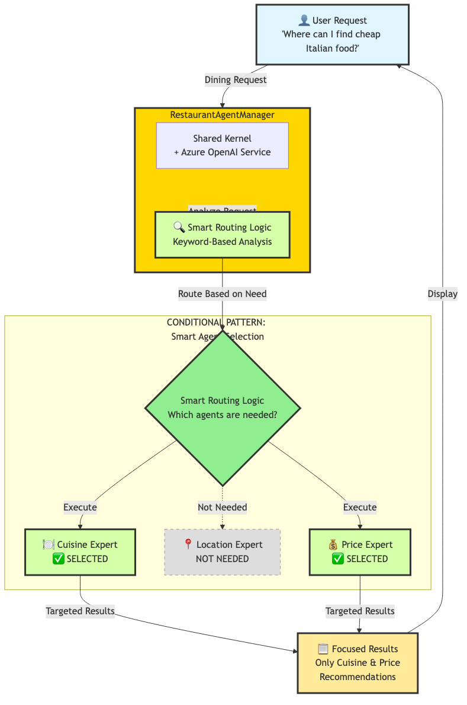

# Restaurant Recommendation System - Complete Solution

## 🌟 Overview

This complete restaurant recommendation system demonstrates **domain adaptation** of multi-agent orchestration patterns using **Semantic Kernel 1.37.0** and **Azure OpenAI**. Building on the travel demo's foundation, this solution shows:

- **Domain Customization**: Adapting the multi-agent pattern for restaurant recommendations
- **Four Specialized Agents**: Cuisine, Location, Price experts plus Coordinator
- **Enhanced Routing Logic**: Domain-specific keyword matching for intelligent agent selection
- **Flexible Architecture**: 4-step workflow adapted to restaurant domain needs

---

## 🏗️ System Architecture

### Three Orchestration Patterns

#### 1. Sequential Pattern - Context-Aware Chain


The Sequential pattern demonstrates **4-step progressive context building** adapted for restaurant recommendations:

- **Step 1**: Cuisine Expert analyzes food preferences
- **Step 2**: Location Expert receives cuisine context and recommends neighborhoods
- **Step 3**: Price Expert uses both cuisine and location context for budget guidance
- **Step 4**: Restaurant Coordinator synthesizes everything into dining recommendations

**Key Difference from Demo:** 4 agents instead of 5 - streamlined for single-venue dining recommendations vs multi-destination travel.

---

#### 2. Parallel Pattern - Maximum Efficiency


The Parallel pattern demonstrates **concurrent execution** of three specialist agents:

- All 3 specialist agents (Cuisine, Location, Price) work simultaneously
- Uses `asyncio.gather()` for concurrent execution
- Results are combined and displayed together

**Key Difference from Demo:** Coordinator not included in parallel execution (only specialists run concurrently).

---

#### 3. Conditional Pattern - Smart Agent Selection



The Conditional pattern demonstrates **enhanced keyword-based routing**:

- Extended keyword lists for restaurant-specific terms ('italian', 'mexican', 'cheap', 'downtown')
- Example: "cheap Italian food" activates Cuisine + Price (Location not needed)
- Resource-efficient and domain-optimized

**Key Difference from Demo:** More extensive cuisine-specific and price-related keywords tailored to restaurant domain.

---

## 🔧 Critical Code Sections (What's Different from Demo)

### 1. Four Agents - Domain Adaptation
**Location:** `restaurant_solution.py:29-90`

Adapted agent structure for restaurant domain:

```python
self.agents = {
    "cuisine": ChatCompletionAgent(...),    # Food types & dishes
    "location": ChatCompletionAgent(...),   # Dining neighborhoods
    "price": ChatCompletionAgent(...),      # Budget guidance
    "coordinator": ChatCompletionAgent(...) # Integration
}
```

**Why this matters:** Unlike the 5-agent travel system, this uses **4 agents** - showing how to adapt the pattern to different domains. No separate "activities" agent because restaurants combine the experience in one visit.

---

### 2. Enhanced Conditional Routing - Restaurant-Specific Keywords
**Location:** `restaurant_solution.py:213-227`

Extended keyword matching customized for restaurant context:

```python
needs_cuisine = any(phrase in request_lower for phrase in [
    'food', 'cuisine', 'italian', 'mexican', 'asian', 'type of food',
    'kind of restaurant', 'what to eat', 'dish', 'menu'
])

needs_location = any(phrase in request_lower for phrase in [
    'where', 'location', 'area', 'neighborhood', 'place', 'part of town',
    'district', 'near', 'close to', 'in the'
])

needs_price = any(phrase in request_lower for phrase in [
    'price', 'budget', 'cost', 'cheap', 'expensive', 'affordable',
    '$', 'money', 'how much', 'costly', 'inexpensive'
])
```

**Why this matters:** More extensive keyword lists than the travel demo - shows how to **customize routing logic** for specific domains. Notice cuisine-specific terms like 'italian', 'mexican', 'dish', 'menu'.

---

### 3. Domain-Specific Agent Instructions
**Location:** `restaurant_solution.py:34-43`

Instructions tailored to restaurant expertise:

```python
instructions="""You are an expert in cuisine and food types.
Recommend specific cuisines and dishes based on dining preferences.

Always provide:
- 2-3 recommended cuisine types that fit the request
- Brief explanation why each cuisine is appropriate
- 2-3 popular dishes to try from each cuisine
- Dietary considerations and alternatives

Focus on matching cuisines to the occasion, preferences, and dietary needs."""
```

**Why this matters:** Compare to travel's "destination recommendations" - same pattern (specialized instructions) but completely different domain knowledge. Shows **reusability** of the multi-agent pattern across domains.

---

### 4. Shorter Sequential Chain - 4 Steps
**Location:** `restaurant_solution.py:94-171`

Streamlined 4-step workflow:

```python
# Step 1: Cuisine recommendations (foundation)
# Step 2: Location recommendations (using cuisine context)
# Step 3: Price recommendations (using cuisine + location context)
# Step 4: Integrated coordination (synthesizes all inputs)
```

**Why this matters:** One fewer step than travel's 5-step chain. Shows the pattern is **flexible** - you choose the number of agents based on domain needs, not a fixed template.

---

## 🚀 Quick Start

### 1. Installation
```bash
pip install semantic-kernel==1.37.0 python-dotenv
```

### 2. Azure OpenAI Configuration
Create `.env` file in the repository root:
```env
AZURE_TEXTGENERATOR_DEPLOYMENT_NAME=your-deployment
AZURE_TEXTGENERATOR_DEPLOYMENT_ENDPOINT=https://your-resource.openai.azure.com/
AZURE_TEXTGENERATOR_DEPLOYMENT_KEY=your-api-key
```

### 3. Run the Solution
```bash
cd lesson-2_implementing_agent_orchestration/exercises/solution
source ../../../.venv/bin/activate
uv run restaurant_solution.py
```

---

## 📊 System Components

### Four Specialist Agents

1. **🍽️ Cuisine Expert** - Food types, dishes, and dietary recommendations
2. **📍 Location Expert** - Dining neighborhoods, atmospheres, and accessibility
3. **💰 Price Expert** - Budget guidance, cost estimates, and value strategies
4. **📋 Restaurant Coordinator** - Integrated planning and comprehensive recommendations

### RestaurantAgentManager

The central orchestration hub that:
- Manages a shared Kernel instance with Azure OpenAI service
- Initializes all 4 specialized ChatCompletionAgent instances
- Implements 3 orchestration patterns (sequential, parallel, conditional)
- Handles runtime lifecycle with InProcessRuntime

---

## 💡 Pattern Comparison

| Pattern | Best For | Context Sharing | Performance | Use Case |
|---------|----------|----------------|-------------|----------|
| **Sequential** | Complex dining plans | 🟢 Full context | 🟡 Medium | Anniversary dinner with specific needs |
| **Parallel** | Quick overview | 🔴 Independent | 🟢 Fastest | General restaurant ideas |
| **Conditional** | Focused requests | 🟡 Selective | 🟢 Efficient | "Just need budget Italian options" |

---

## 🎯 Key Learning Points

### Domain Adaptation
- **Same Pattern, Different Domain**: Multi-agent orchestration works for travel, restaurants, and any complex recommendation system
- **Flexible Agent Count**: 4 agents here vs 5 in travel - adapt to your domain's needs
- **Custom Instructions**: Each domain requires specialized agent expertise

### Enhanced Conditional Logic
- **Extended Keywords**: More comprehensive than demo - shows production-ready routing
- **Domain-Specific Terms**: Cuisine types, price indicators, location phrases
- **Scalable Approach**: Easy to add more keywords as you learn user patterns

### Production Best Practices
- **Shared Kernel**: Single Azure OpenAI service for all agents
- **Error Handling**: Graceful degradation for individual agent failures
- **Proper Lifecycle**: Runtime start and stop management
- **Async Patterns**: Efficient concurrent execution

---

## 📝 Example Scenarios

### Sequential Pattern Output
```
🚀 Starting SEQUENTIAL Orchestration
Pattern: Cuisine → Location → Price → Coordinator
------------------------------------------------------------
1. 🍽️ Consulting Cuisine Expert...
   ✓ Cuisine analysis complete: 487 characters
2. 📍 Consulting Location Expert...
   ✓ Location analysis complete: 392 characters
3. 💰 Consulting Price Expert...
   ✓ Price analysis complete: 351 characters
4. 📋 Generating Integrated Recommendation...
   ✓ Integrated plan complete: 624 characters
```

**Notice:** Context builds progressively - coordinator has 624 characters because it received all previous analyses.

---

## 🔄 Extending the Solution

### Additional Specialists
- **Dietary Agent**: Allergies, vegan, gluten-free expertise
- **Occasion Agent**: Birthday, business, casual, celebration specialists
- **Cuisine Deep-Dive**: Italian, Asian, Mexican sub-specialists

### Advanced Integration
- **Real Restaurant APIs**: Yelp, Google Places, OpenTable
- **User Profiles**: Preference learning and history
- **Reservation Systems**: Direct booking integration
- **Review Analysis**: Aggregate ratings and sentiment

---

## 🏆 Comparison with Travel Demo

| Aspect | Travel Demo | Restaurant Solution |
|--------|-------------|---------------------|
| **Agents** | 5 (Dest, Flights, Accom, Activities, Coord) | 4 (Cuisine, Location, Price, Coord) |
| **Sequential Steps** | 5-step chain | 4-step chain |
| **Conditional Keywords** | Basic travel terms | Extended food/price terms |
| **Domain** | Multi-destination planning | Single-venue dining |
| **Coordinator Input** | 4 specialist inputs | 3 specialist inputs |

---

## 📚 When to Use Each Pattern

### Use Sequential Pattern When:
- Planning special occasion dining (anniversaries, celebrations)
- Multiple factors need coordination (cuisine, location, budget, atmosphere)
- Context from one decision informs the next

### Use Parallel Pattern When:
- Quick restaurant brainstorming
- General dining ideas without specific constraints
- Speed is more important than context sharing

### Use Conditional Pattern When:
- Highly specific requests ("cheap Italian downtown")
- Only certain aspects matter (just budget, just cuisine type)
- Resource optimization is important

---

## 📖 Learn More

For more information about Semantic Kernel and multi-agent systems, visit:
- [Semantic Kernel Documentation](https://learn.microsoft.com/en-us/semantic-kernel/)
- [Azure OpenAI Service](https://azure.microsoft.com/en-us/products/ai-services/openai-service)