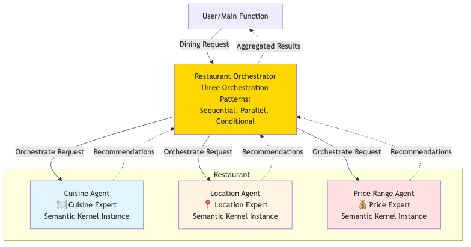

# 🍽️ Restaurant Recommendation System - Complete Solution

## 🎉 Solution Overview

This complete restaurant recommendation system demonstrates **advanced multi-agent orchestration** using **Semantic Kernel 1.37.0** and **Azure OpenAI Foundry**. The solution features:

* **Four Specialized Agents**: Comprehensive dining expertise including coordinator integration
* **Three Orchestration Patterns**: Sequential context-sharing, parallel efficiency, and intelligent conditional routing
* **Modern Architecture**: Shared kernel instance, proper runtime management, and production-ready error handling
* **Professional Output**: Structured recommendations with integrated planning and budget guidance

---

## 🏗️ Enhanced System Architecture



The solution implements a sophisticated multi-agent architecture:

- **RestaurantAgentManager**: Central orchestrator with shared kernel and Azure Foundry
- **Four Specialized Agents** with distinct expertise:
  - 🍽️ **Cuisine Expert**: Food types, dishes, and culinary recommendations
  - 📍 **Location Expert**: Neighborhoods, atmospheres, and dining districts
  - 💰 **Price Expert**: Budget guidance, cost estimates, and value strategies
  - 📋 **Restaurant Coordinator**: Integrated planning and comprehensive recommendations
- **Azure OpenAI Foundry**: Enterprise AI services for all agents
- **Three Orchestration Engines**: Sequential, Parallel, and Conditional execution modes

---

## 🔧 Implementation Highlights

### 1. **Complete Agent Ecosystem**

**All four agents are fully implemented with specialized expertise:**

```python
self.agents = {
    "cuisine": ChatCompletionAgent(...),     # Food types and dishes
    "location": ChatCompletionAgent(...),    # Dining areas and neighborhoods
    "price": ChatCompletionAgent(...),       # Budget and cost guidance
    "coordinator": ChatCompletionAgent(...)  # Integrated planning
}
```

### 2. **Advanced Sequential Orchestration**

The solution implements a sophisticated 4-step workflow:

```
Request → Cuisine → Location → Price → Coordinator → Integrated Plan
```

**Each step builds on previous analyses:**
- **Step 1**: Cuisine provides foundation recommendations
- **Step 2**: Location considers cuisine preferences and context
- **Step 3**: Price integrates cuisine choices and location factors
- **Step 4**: Coordinator synthesizes all inputs into comprehensive plan

### 3. **Enhanced Conditional Orchestration**

**Intelligent agent selection with advanced keyword analysis:**

```python
# Smart routing based on request content patterns
needs_cuisine = any(phrase in request_lower for phrase in [
    'food', 'cuisine', 'italian', 'mexican', 'asian', 'type of food',
    'kind of restaurant', 'what to eat', 'dish', 'menu'
])

needs_location = any(phrase in request_lower for phrase in [
    'where', 'location', 'area', 'neighborhood', 'place', 'part of town',
    'district', 'near', 'close to', 'in the'
])

needs_price = any(phrase in request_lower for phrase in [
    'price', 'budget', 'cost', 'cheap', 'expensive', 'affordable',
    '$', 'money', 'how much', 'costly', 'inexpensive'
])
```

### 4. **Professional Agent Instructions**

Each agent includes detailed, structured instructions:

**Cuisine Expert:**
- 2-3 recommended cuisine types with explanations
- Popular dishes and dietary considerations
- Occasion and preference matching

**Location Expert:**
- Neighborhood and dining district recommendations
- Atmosphere descriptions and transportation advice
- Timing and crowd level guidance

**Price Expert:**
- Price ranges with cost estimates
- Value-for-money strategies
- Budget optimization tips

**Restaurant Coordinator:**
- Consolidated specific recommendations
- Budget breakdown and coordination
- Reservation and timing advice

---

## 🚀 Key Features

### Modern Semantic Kernel 1.37.0
- **ChatCompletionAgent**: Latest agent framework with proper descriptions
- **Shared Kernel Instance**: Single Azure Foundry service for optimal performance
- **Runtime Management**: Proper `InProcessRuntime` lifecycle handling
- **Async Patterns**: Efficient concurrent execution with `asyncio.gather()`

### Production-Ready Architecture
- **Comprehensive Error Handling**: Graceful degradation for individual agent failures
- **Performance Optimization**: Parallel execution with sequential context sharing
- **Resource Efficiency**: Shared kernel and proper resource management
- **Scalable Design**: Easy to add new specialist agents

### Professional Output
- **Structured Formatting**: Clear section separation with emoji indicators
- **Response Tracking**: Performance monitoring with character counts
- **Integrated Planning**: Coordinator synthesizes multi-agent inputs
- **User-Friendly**: Practical, actionable restaurant recommendations

---

## 📊 Sample Output

```text
🍴 RESTAURANT RECOMMENDATION SYSTEM - COMPLETE SOLUTION
Modern Multi-Agent Orchestration with Semantic Kernel 1.37.0
======================================================================

📝 SCENARIO 1: I want to celebrate my anniversary with a romantic dinner...
======================================================================

🔧 Testing SEQUENTIAL Pattern:
======================================================================
🚀 Starting SEQUENTIAL Orchestration
Pattern: Cuisine → Location → Price → Coordinator
----------------------------------------------------------------------
1. 🍽️ Consulting Cuisine Expert...
   ✓ Cuisine analysis complete: 245 characters
2. 📍 Consulting Location Expert...
   ✓ Location analysis complete: 198 characters  
3. 💰 Consulting Price Expert...
   ✓ Price analysis complete: 187 characters
4. 📋 Generating Integrated Recommendation...
   ✓ Integrated plan complete: 356 characters

🎉 SEQUENTIAL ORCHESTRATION COMPLETE
======================================================================

🍽️ **Cuisine Recommendations**

Perfect Cuisine Choices for Your Anniversary:
• Italian: Romantic atmosphere, intimate settings, classic dishes
• French: Elegant dining experience, sophisticated ambiance
• Modern American: Creative dishes, upscale casual vibe

Popular Dishes & Considerations:
- Osso Buco, Truffle Pasta, Tiramisu (Italian)
- Coq au Vin, Duck Confit, Crème Brûlée (French)
- Many vegetarian and gluten-free options available
----------------------------------------------------------------------

📋 **Integrated Restaurant Plan**

COMPREHENSIVE ANNIVERSARY DINING RECOMMENDATION:

Top Restaurant Suggestions:
1. "Bella Notte" - Italian, Downtown (Romantic, Intimate)
2. "Le Jardin" - French, Riverside (Elegant, Scenic Views)

Budget Summary: $150-250 total
• Dinner for two: $120-180
• Drinks & dessert: $30-50
• Transportation: $20-30

Reservation Tips: Book 1-2 weeks in advance, request window seating
======================================================================
```

---

## 🛠️ Running the Solution

### 1. Prerequisites

```bash
pip install semantic-kernel==1.37.0 python-dotenv
```

### 2. Azure OpenAI Foundry Configuration

Create `.env` file with Foundry credentials:

```env
AZURE_TEXTGENERATOR_DEPLOYMENT_NAME=your-foundry-deployment
AZURE_TEXTGENERATOR_DEPLOYMENT_ENDPOINT=https://your-resource.openai.azure.com/
AZURE_TEXTGENERATOR_DEPLOYMENT_KEY=your-api-key
```

### 3. Execute the Solution

```bash
python restaurant_solution.py
```

---

## 🎯 Technical Achievements

### Production-Grade Architecture
- **Shared Resource Management**: Single kernel instance across all agents
- **Comprehensive Error Handling**: Robust exception management and graceful degradation
- **Performance Optimization**: Parallel execution with sequential context awareness
- **Scalable Design**: Modular architecture for easy agent addition

### Advanced Agent Patterns
- **Context-Aware Processing**: Sequential workflow with progressive context building
- **Intelligent Routing**: Conditional execution based on sophisticated request analysis
- **Domain Specialization**: Each agent has tailored expertise and response structures
- **Integrated Coordination**: Coordinator synthesizes multi-agent inputs comprehensively

### Enterprise Features
- **Azure OpenAI Foundry**: All agents use enterprise AI services
- **Professional Logging**: Clear progress tracking and performance metrics
- **Structured Output**: Well-organized recommendations with visual indicators
- **Resource Efficiency**: Optimized runtime and kernel management

---

## 🔄 Extension Opportunities

The solution provides a foundation for:

* **Additional Specialists**: 
  - **Dietary Agent**: Allergies, restrictions, and special diets
  - **Occasion Agent**: Birthday, business, casual, celebration expertise
  - **Cuisine Specialist**: Deep expertise in specific culinary traditions

* **Advanced Integration**:
  - **Real Restaurant APIs**: Live menu and availability data
  - **User Preference Learning**: Personalized recommendation history
  - **Reservation Systems**: Direct booking integration
  - **Review Aggregation**: Rating and review analysis

* **Intelligent Enhancements**:
  - **ML-Powered Routing**: AI-based agent relevance scoring
  - **Hybrid Patterns**: Combined sequential and parallel execution
  - **Predictive Analysis**: Popularity and wait time forecasting
  - **Multi-Modal Input**: Image and location-based recommendations

---

## 📚 Learning Outcomes Demonstrated

This solution exemplifies:

* **Modern Agent Framework**: Professional use of Semantic Kernel 1.37.0 agent patterns
* **Multi-Agent Orchestration**: Sophisticated coordination between specialized AI agents
* **Context Management**: Building sequential workflows with shared analysis context
* **Intelligent Systems**: Conditional execution and smart resource allocation
* **Production Best Practices**: Error handling, performance optimization, and maintainability
* **Real-World Application**: Practical restaurant recommendation use case with business value

---

## 🏆 Pattern Comparison

| Pattern | Best For | Coordination | Context Usage | Performance | Use Case Example |
|---------|----------|--------------|---------------|-------------|------------------|
| **Sequential** | Complex multi-factor planning | 🟢 High | 🟢 Full context sharing | 🟡 Medium | Anniversary dinner with specific preferences |
| **Parallel** | Quick comprehensive overview | 🟡 Medium | 🔴 Independent | 🟢 Fastest | General restaurant ideas brainstorming |
| **Conditional** | Specific, focused requests | 🟢 Smart routing | 🟡 Selective | 🟢 Efficient | "Just need budget for Italian food" |

---