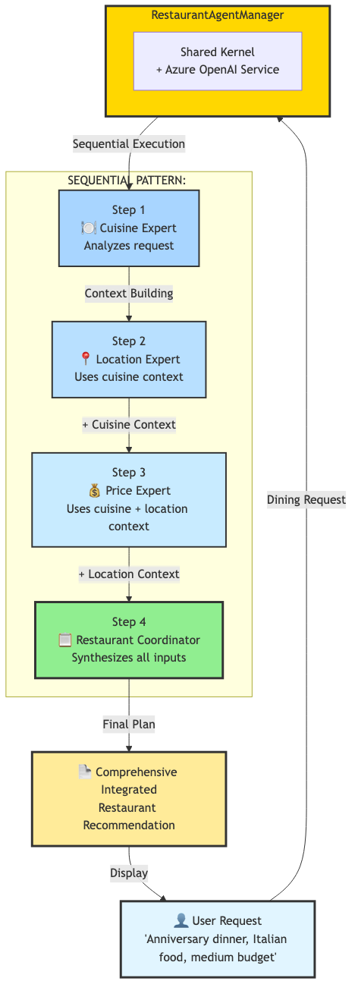
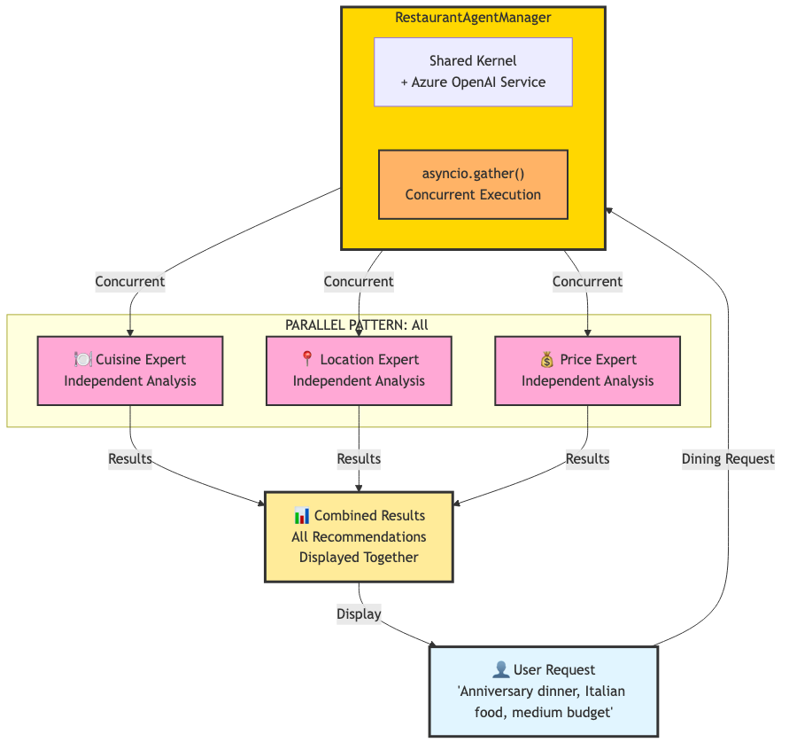

# 🍽️ Restaurant Recommendation System - Starter Code

## 🎯 Learning Exercise Overview

This starter code provides the foundation for building an advanced multi-agent restaurant recommendation system using **Semantic Kernel 1.37.0**. Your task is to complete the implementation by:

* **Creating Specialized Agents**: Implement all required restaurant agents with modern configurations
* **Implementing Orchestration Patterns**: Build three different coordination strategies
* **Adding Coordinator Agent**: Create integrated restaurant recommendations
* **Modern Architecture**: Use shared kernel and proper runtime management

---

## 🏗️ System Architecture Framework

### Sequential Pattern - Context-Aware Chain


### Parallel Pattern - Maximum Efficiency


### Conditional Pattern - Smart Agent Selection


The starter code provides the basic structure:
- **RestaurantAgentManager** orchestrates agent interactions
- **Four Placeholder Agents** ready for your implementation
- **Shared Kernel Instance** with Azure OpenAI Foundry
- **Three Orchestration Patterns**: Sequential, Parallel, Conditional frameworks

---

## 📋 Exercise Tasks

### 1. **Agent Creation & Configuration**

**TODO: Implement all agents in the `__init__` method:**

```python
self.agents = {
    "cuisine": None,      # Create Cuisine Expert agent
    "location": None,     # Create Location Expert agent  
    "price": None,        # Create Price Range Expert agent
    "coordinator": None   # Create Restaurant Coordinator agent
}
```

**Each agent should include:**
- **Name**: Follow naming conventions (e.g., "Cuisine_Expert")
- **Description**: Clear domain expertise description
- **Instructions**: Detailed role-specific guidance and response structure

### 2. **Sequential Orchestration Implementation**

**TODO: Complete the `sequential_orchestration` method:**

- **Step 1**: Cuisine analysis (foundation)
- **Step 2**: Location analysis (using cuisine context)
- **Step 3**: Price analysis (using cuisine + location context)
- **Step 4**: Integrated coordination and final recommendations

### 3. **Parallel Orchestration Completion**

**TODO: Implement the `parallel_orchestration` method:**

- Use `asyncio.gather()` for concurrent agent execution
- Handle exceptions gracefully for each agent
- Format results consistently with emoji indicators

### 4. **Conditional Orchestration Building**

**TODO: Create the `conditional_orchestration` method:**

- Analyze request content to determine needed agents
- Implement smart routing logic based on keywords
- Execute only relevant agents for efficiency

---

## 🔧 Technical Framework

### Modern Semantic Kernel 1.37.0 Features

* **ChatCompletionAgent**: Modern agent class with descriptions and instructions
* **Shared Kernel Instance**: Single Azure OpenAI Foundry service for all agents
* **InProcessRuntime**: Proper runtime lifecycle management
* **Async/Await Patterns**: Efficient concurrent processing

### Pre-Implemented Structure

* **Error Handling**: Basic exception handling in helper methods
* **Result Display**: Clean formatting system for outputs
* **Environment Validation**: Azure credential checking
* **Scenario Testing**: Multiple restaurant use cases provided

### Performance Foundation

* **Shared Resources**: Single kernel instance optimization
* **Concurrent Processing**: Framework for parallel execution
* **Context Management**: Structure for sequential context sharing

---

## 🚀 Getting Started

### 1. Environment Setup

```bash
pip install semantic-kernel==1.37.0 python-dotenv
```

### 2. Azure OpenAI Configuration

Create `.env` file with Foundry credentials:

```env
AZURE_TEXTGENERATOR_DEPLOYMENT_NAME=your-foundry-deployment
AZURE_TEXTGENERATOR_DEPLOYMENT_ENDPOINT=https://your-resource.openai.azure.com/
AZURE_TEXTGENERATOR_DEPLOYMENT_KEY=your-api-key
```

### 3. Run the Starter Code

```bash
python restaurant_starter.py
```

---

## 🎯 Expected Learning Outcomes

After completing this exercise, you will understand:

* **Modern Agent Patterns**: Creating and configuring `ChatCompletionAgent` instances
* **Multi-Agent Orchestration**: Three distinct coordination strategies
* **Context-Aware Processing**: Building sequential workflows with shared context
* **Intelligent Routing**: Conditional execution based on request analysis
* **Production Best Practices**: Error handling, resource management, and performance

---

## 🔍 Exercise Instructions

### Phase 1: Agent Foundation
1. **Review the TODOs**: Each TODO comment indicates required implementation
2. **Create Agent Classes**: Build CuisineAgent, LocationAgent, PriceAgent, CoordinatorAgent
3. **Configure Agents**: Set proper names, descriptions, and instructions
4. **Test Basic Setup**: Verify environment and agent initialization

### Phase 2: Orchestration Implementation  
5. **Complete Sequential Pattern**: Build context-aware processing chain
6. **Implement Parallel Pattern**: Use `asyncio.gather()` for concurrency
7. **Build Conditional Pattern**: Create intelligent agent selection
8. **Test Each Pattern**: Use provided restaurant scenarios

### Phase 3: Integration & Refinement
9. **Verify All Patterns**: Ensure all three orchestration methods work
10. **Test Edge Cases**: Handle errors and unusual requests gracefully
11. **Optimize Performance**: Ensure efficient resource usage
12. **Document Learnings**: Understand trade-offs between patterns

---

## 📚 Learning Progression

This exercise builds progressively:

1. **Basic Agent Setup** → Understanding Semantic Kernel agent framework
2. **Pattern Implementation** → Three distinct orchestration strategies  
3. **Context Management** → Sequential workflows with shared analysis
4. **Intelligent Systems** → Conditional execution and smart routing
5. **Production Readiness** → Error handling and performance optimization

---

## 🍴 Restaurant Scenarios Provided

The starter includes diverse test cases:
- **Romantic Anniversary**: Italian food, medium budget
- **Family Dining**: Kid-friendly, casual atmosphere  
- **Business Lunch**: Quiet, professional, budget-conscious
- **Authentic Cuisine**: Specific food type, flexible budget

---

## 🆘 Getting Help

If you get stuck:
1. Review Semantic Kernel 1.37.0 documentation for `ChatCompletionAgent`
2. Check error messages carefully - they often indicate specific issues
3. Ensure Azure OpenAI credentials are correctly configured
4. Verify all agents have proper names, descriptions, and instructions
5. Use the provided helper methods for consistent formatting

---

## ✅ Success Criteria

Your implementation is complete when:
- All four agents are properly configured and functional
- Sequential orchestration works with context sharing
- Parallel orchestration executes all agents simultaneously  
- Conditional orchestration intelligently selects relevant agents
- No TODO comments remain in the code
- All test scenarios execute successfully
- Error handling works gracefully for all patterns

---
