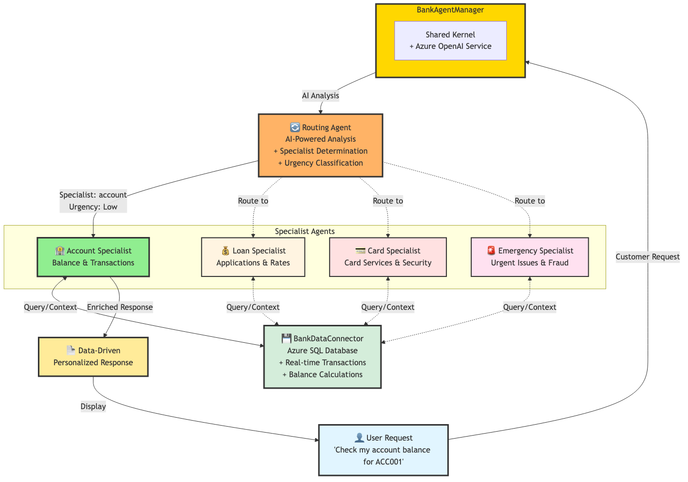

# 🏦 Banking Multi-Agent System with Intelligent Routing

## 🌟 Overview

This demo introduces **intelligent routing and data flow** in multi-agent systems using **Semantic Kernel 1.37.0** and **Azure OpenAI**. It demonstrates how a routing agent can analyze customer requests using AI and direct them to specialized banking agents with **real-time Azure SQL integration** for context-enriched responses.

**Key Concepts:**
- **Intelligent Routing**: AI-powered request analysis and automatic specialist assignment
- **Data Flow**: Real-time database integration for context-enriched responses
- **Urgency Classification**: Automatic priority detection (Low/Medium/High/Emergency)
- **Specialist Agents**: Four domain-specific agents (Account, Loan, Card, Emergency)

---

## 🏗️ System Architecture



The routing architecture demonstrates **intelligent request distribution**:

- **Routing Agent** analyzes customer requests using AI to determine specialist and urgency
- Routes to appropriate **Specialist Agent** based on content analysis and keywords
- **BankDataConnector** provides real-time Azure SQL data for context enrichment
- Specialist agents process requests with enriched transaction data
- Responses are personalized with live account information

**Key Pattern:** Unlike sequential or parallel orchestration (Lessons 1-2), routing uses **AI-powered content analysis** to dynamically assign requests to the best specialist.

---

## 🔧 Critical Code Sections

### 1. Routing Agent with AI-Powered Analysis
**Location:** `bank_routing_demo.py:251-278`

Configuring the routing agent to analyze requests and make routing decisions:

```python
"router": ChatCompletionAgent(
    kernel=self.kernel,
    name="Routing_Agent",
    description="Intelligent router for banking request distribution",
    instructions="""You are an intelligent routing agent. Analyze banking requests and route to appropriate specialists.

    Analyze each request and determine:
    1. Which specialist should handle it (account/loan/card/emergency)
    2. The urgency level (Low/Medium/High/Emergency)
    3. Brief reasoning for your decision

    Specialist Responsibilities:
    - account: Account balances, transactions, account information, transfers
    - loan: Loan applications, mortgages, personal loans, interest rates, financing
    - card: Credit/debit card issues, lost cards, card applications, disputes
    - emergency: Fraud, stolen cards, urgent account issues, security breaches

    Urgency Guidelines:
    - Low: General inquiries, information requests, product questions
    - Medium: Service requests, application status, routine issues
    - High: Time-sensitive issues, payment problems, card declines
    - Emergency: Fraud, security breaches, lost/stolen cards, unauthorized transactions

    Respond in this exact format:
    Specialist: [account/loan/card/emergency]
    Urgency: [Low/Medium/High/Emergency]
    Reasoning: [brief explanation]"""
)
```

**Why this matters:** This is THE core of intelligent routing - the routing agent uses AI to understand request content, classify urgency, and determine the best specialist. The structured format ensures consistent routing decisions that can be parsed programmatically.

---

### 2. AI-Powered Routing Decision Process
**Location:** `bank_routing_demo.py:283-302`

How the routing agent analyzes requests and makes decisions:

```python
async def route_customer_request(self, customer_request: str) -> dict:
    """Intelligent routing of customer requests to appropriate specialists"""
    print(f"📥 Customer Request: {customer_request}")
    print("🔄 Analyzing request and determining routing...")

    # Use routing agent to analyze the request
    routing_prompt = f"CUSTOMER REQUEST: {customer_request}"

    routing_response = await self.agents["router"].get_response(routing_prompt)
    routing_content = str(routing_response.content)

    # Parse routing decision
    routing_decision = self._parse_routing_decision(routing_content)

    print(f"✅ Routing Decision:")
    print(f"   Specialist: {routing_decision['specialist']}")
    print(f"   Urgency: {routing_decision['urgency']}")
    print(f"   Reasoning: {routing_decision['reasoning']}")

    return routing_decision
```

**Why this matters:** Shows how to use an AI agent as a router rather than hard-coded rules. The routing agent uses natural language understanding to make intelligent decisions, providing transparency through reasoning explanations.

---

### 3. Parsing Structured Routing Decisions
**Location:** `bank_routing_demo.py:304-323`

Extracting structured information from AI routing response:

```python
def _parse_routing_decision(self, routing_text: str) -> dict:
    """Parse the routing decision from the AI response"""
    lines = routing_text.strip().split('\n')
    decision = {
        "specialist": "account",  # default
        "urgency": "Medium",      # default
        "reasoning": "Unable to parse routing decision",
        "raw_response": routing_text
    }

    for line in lines:
        line = line.strip()
        if line.startswith('Specialist:'):
            decision["specialist"] = line.split(':')[1].strip().lower()
        elif line.startswith('Urgency:'):
            decision["urgency"] = line.split(':')[1].strip()
        elif line.startswith('Reasoning:'):
            decision["reasoning"] = line.split(':')[1].strip()

    return decision
```

**Why this matters:** Demonstrates how to extract structured data from AI responses. By instructing the routing agent to use a specific format, we can reliably parse routing decisions programmatically while maintaining flexibility for AI reasoning.

---

### 4. Data-Enriched Specialist Processing
**Location:** `bank_routing_demo.py:325-353`

Context enrichment with real-time Azure SQL data:

```python
async def process_with_specialist(self, customer_request: str, specialist: str, urgency: str) -> str:
    """Process customer request with the appropriate specialist"""
    print(f"🔧 Connecting to {specialist} specialist...")

    # Get relevant transaction data for context
    accounts = self.data_connector.get_accounts()
    transaction_context = ""

    if specialist == "account":
        # Provide transaction data for account inquiries
        recent_transactions = []
        for account in accounts[:2]:  # Show data for first 2 accounts
            transactions = self.data_connector.get_recent_transactions(account, 3)
            balance = self.data_connector.get_account_balance(account)
            recent_transactions.append(f"Account {account} (Balance: ${balance:.2f}): {transactions}")

        transaction_context = f"\n\nACCOUNT DATA CONTEXT:\n" + "\n".join(recent_transactions)

    # Add urgency context for emergency situations
    urgency_context = ""
    if urgency in ["High", "Emergency"]:
        urgency_context = f"\n\n🚨 URGENCY: {urgency} - Requiring immediate attention"

    # Process request with specialist agent
    full_request = f"CUSTOMER REQUEST: {customer_request}{transaction_context}{urgency_context}"

    specialist_response = await self.agents[specialist].get_response(full_request)

    return f"🏦 **{specialist.capitalize()} Assistance**\n\n{specialist_response.content}"
```

**Why this matters:** Shows how to enrich agent context with real-time data based on the routing decision. Account specialists get transaction data from Azure SQL, while emergency requests get urgency flags - demonstrating data flow from database to AI response.

---

## 🚀 Quick Start

### 1. Installation
```bash
pip install semantic-kernel==1.37.0 python-dotenv pyodbc
# Install ODBC driver for macOS
brew install unixodbc
```

### 2. Azure Configuration
Create `.env` file in the repository root:
```env
# Azure OpenAI Configuration
AZURE_DEPLOYMENT_NAME=your-deployment
AZURE_DEPLOYMENT_ENDPOINT=https://your-resource.openai.azure.com/
AZURE_DEPLOYMENT_KEY=your-api-key

# Azure SQL Database Configuration
AZURE_SQL_CONNECTION_STRING=Driver={ODBC Driver 18 for SQL Server};Server=your-server.database.windows.net;Database=your-database;Uid=your-username;Pwd=your-password;Encrypt=yes;TrustServerCertificate=no;Connection Timeout=30;
```

### 3. Database Setup
Execute SQL schema using `create_example_transaction_table.sql` and insert data using `insert_example_transaction_query.sql` in your Azure SQL database.

### 4. Run the Demo
```bash
cd lesson-3_implementing_routing_and_data_flow_in_agentic_systems/demo
source ../../.venv/bin/activate
uv run bank_routing_demo.py
```

---

## 📊 System Components

### Five Specialized Agents

1. **🔄 Routing Agent** - AI-powered request analysis and specialist assignment
2. **🏦 Account Specialist** - Balance checks, transaction history, account management
3. **💰 Loan Specialist** - Loan applications, mortgage inquiries, financing options
4. **💳 Card Specialist** - Credit/debit card services, fraud prevention, replacements
5. **🚨 Emergency Specialist** - Urgent security issues, immediate action required

### BankAgentManager

The central orchestration hub that:
- Manages a shared Kernel instance with Azure OpenAI service
- Initializes all 5 specialized ChatCompletionAgent instances
- Implements intelligent routing with AI-powered analysis
- Handles real-time Azure SQL database integration
- Manages runtime lifecycle with InProcessRuntime

### BankDataConnector

Real-time data integration layer:
- Connects to Azure SQL Example_Transactions table
- Provides balance calculations and transaction history
- Enriches specialist agent context with live data
- Handles database connection lifecycle

---

## 💡 Routing Patterns

| Request Type | Specialist | Urgency | Example |
|------|--------|----------------|----------|
| **Account Inquiry** | Account | Low | "Check my balance for ACC001" |
| **Loan Application** | Loan | Medium | "Apply for $10,000 personal loan" |
| **Card Issue** | Card | Medium | "Request new debit card" |
| **Security Breach** | Emergency | Emergency | "My credit card was stolen" |

**Key Difference from Lessons 1-2:** Instead of pre-defined orchestration patterns (sequential/parallel/conditional), routing uses **AI analysis** to dynamically determine which specialist should handle each request.

---

## 📝 Example Output

```text
🏦 BANKING MULTI-AGENT SYSTEM - COMPLETE SOLUTION
Intelligent Routing and Data Flow with Azure SQL
Semantic Kernel 1.37.0 with Modern Agent Framework
======================================================================

######################################################################
CUSTOMER REQUEST #1
######################################################################
📥 Customer Request: I want to check my account balance and recent transactions for ACC001
🔄 Analyzing request and determining routing...
✅ Routing Decision:
   Specialist: account
   Urgency: Low  
   Reasoning: Customer is requesting account-specific balance and transaction history

🔧 Connecting to account specialist...

🎯 REQUEST PROCESSING COMPLETE
Handled by: Account Specialist
Urgency: Low
======================================================================
🏦 **Account Assistance**

I can help you with your account inquiry for ACC001.

**ACCOUNT SUMMARY:**
- Current Balance: $649.50
- Available Balance: $649.50
- Account Status: Active

**RECENT TRANSACTIONS (Last 5):**
1. Today - Deposit: $1,000.00 ✅ (Initial account funding)
2. Today - Withdrawal: $150.50 ✅ (ATM withdrawal) 
3. Yesterday - Transfer: $200.00 ⏳ (Transfer to savings account)

**ACCOUNT INSIGHTS:**
- 3 transactions this month
- No pending transactions
- Account in good standing

Would you like more details about any specific transaction or additional account services?
======================================================================
```

---

## 🎯 Key Learning Points

### Intelligent Routing Fundamentals
- **AI-Powered Router Agent**: Using an agent to analyze and route requests vs hard-coded rules
- **Structured AI Responses**: Instructing agents to return parseable, structured output
- **Urgency Classification**: Automatic priority detection based on request content
- **Transparent Reasoning**: AI provides explanations for routing decisions

### Data Flow Patterns
- **Context Enrichment**: Adding real-time database data to agent context
- **Conditional Data Loading**: Only loading relevant data based on specialist type
- **Azure SQL Integration**: Real-time transaction data access with PyODBC
- **Database Connection Management**: Proper lifecycle with context managers

### Production Best Practices
- **Shared Kernel Pattern**: Single kernel serves all agents (router + 4 specialists)
- **Error Handling**: Graceful degradation for database and routing failures
- **Parsing Flexibility**: Defaults for unparseable AI responses
- **Modern Framework**: Uses latest Semantic Kernel 1.37.0 ChatCompletionAgent API

---

## 📖 Learn More

For more information about Semantic Kernel and multi-agent systems, visit:
- [Semantic Kernel Documentation](https://learn.microsoft.com/en-us/semantic-kernel/)
- [Azure OpenAI Service](https://azure.microsoft.com/en-us/products/ai-services/openai-service)
- [Azure SQL Database](https://azure.microsoft.com/en-us/products/azure-sql/database/)
