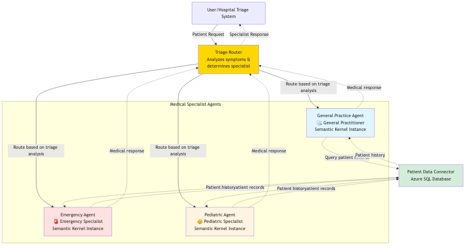

# 🏥 Hospital Triage Multi-Agent System - Starter Code

## 🎯 Exercise Overview

Transform this starter code into a complete **intelligent hospital triage system** using **Semantic Kernel 1.37.0** and **Azure SQL Server integration**! You'll implement AI-powered routing that directs patient requests to appropriate medical specialists with real-time database integration.

## System Architecture



This diagram depicts the modern hospital triage system architecture featuring intelligent patient request routing to specialized medical agents with integrated Azure SQL Server data connector for patient records and visit history management.

---

## 🏗️ Modern System Architecture

### 🔹 Centralized Agent Management

* **MedicalAgentManager**
  * Shared kernel instance with Azure OpenAI
  * Unified runtime management with `InProcessRuntime`
  * Coordinated agent orchestration and data flow
  * Production-ready error handling

### 🔹 Intelligent Medical Routing

* **Routing Agent** with AI-Powered Triage
  * Analyzes patient symptoms using advanced NLP
  * Determines specialist assignment with medical reasoning
  * Classifies urgency levels (Routine/Urgent/Emergency)
  * Provides context-aware routing decisions

### 🔹 Specialized Medical Agents

1. **🩺 General Practitioner** - Routine symptoms, chronic conditions, general health
2. **🚨 Emergency Specialist** - Critical care, severe symptoms, injuries
3. **👶 Pediatric Specialist** - Children's health, age-appropriate care *(TODO)*

### 🔹 Real-Time Data Integration

* **PatientDataConnector** with Azure SQL Server
  * Live connection to `patients` and `patient_visits` databases
  * Real-time patient history and medical records
  * Automated consultation logging
  * Production-grade error handling

---

## 📋 Exercise Tasks

### Task 1: Azure SQL Database Integration

**File: `medical_triage_system.py`**

#### 1.1 Complete `PatientDataConnector` Class

* **Implement `_load_patient_data()`** - Query Azure SQL database for patient records
* **Implement `get_patient_info()`** - Add actual SQL queries with parameterized inputs
* **Implement `add_patient_visit()`** - Insert new patient visit records

#### 1.2 Initialize Data Connector

* **Uncomment and initialize** `self.data_connector` in `MedicalAgentManager`
* Ensure all agents can access real patient data

---

### Task 2: Implement Pediatric Specialist

**File: `medical_triage_system.py`**

#### 2.1 Create `PediatricAgent`

* Uncomment and implement the pediatric specialist agent
* Add to the agents dictionary in `MedicalAgentManager`
* Configure with child-specific medical instructions

---

### Task 3: Complete Routing System

**File: `medical_triage_system.py`**

#### 3.1 Implement Routing Parser

* Complete `_parse_routing_decision()` method
* Extract specialist, urgency, and reasoning from AI response
* Handle edge cases and malformed responses

#### 3.2 Integrate Patient Data

* Add patient context extraction in `process_with_specialist()`
* Use patient history from database when available
* Log all consultations to database

---

### Task 4: Database Connection Testing

**File: `medical_triage_system.py`**

* Uncomment and implement database connection testing in `main()`
* Validate Azure SQL connectivity
* Test patient data retrieval

---

## 🛠️ Setup Instructions

### 1. Installation with Latest Dependencies

```bash
pip install semantic-kernel==1.37.0 python-dotenv pyodbc
```

### 2. Environment Configuration

Create a `.env` file with your Azure services:

```env
# Azure OpenAI Configuration
AZURE_TEXTGENERATOR_DEPLOYMENT_NAME=your-deployment-name
AZURE_TEXTGENERATOR_DEPLOYMENT_ENDPOINT=https://your-resource.openai.azure.com/
AZURE_TEXTGENERATOR_DEPLOYMENT_KEY=your-api-key

# Azure SQL Database Configuration
AZURE_SQL_CONNECTION_STRING=Driver={ODBC Driver 18 for SQL Server};Server=your-server.database.windows.net;Database=your-database;Uid=your-username;Pwd=your-password;Encrypt=yes;TrustServerCertificate=no;Connection Timeout=30;
```

### 3. Database Schema Setup

Execute the SQL schema in your Azure SQL database:

```sql
-- Patients table
CREATE TABLE patients (
    patient_id INT PRIMARY KEY,
    name NVARCHAR(100),
    age INT,
    last_visit DATE,
    conditions NVARCHAR(500)
);

-- Patient visits table
CREATE TABLE patient_visits (
    visit_id INT IDENTITY(1,1) PRIMARY KEY,
    patient_name NVARCHAR(100),
    symptoms NVARCHAR(1000),
    diagnosis NVARCHAR(500),
    visit_date DATETIME DEFAULT GETDATE()
);

-- Sample patient data
INSERT INTO patients (patient_id, name, age, last_visit, conditions) VALUES
(1, 'John Smith', 45, '2024-01-10', 'hypertension'),
(2, 'Maria Garcia', 32, '2024-01-15', 'asthma'),
(3, 'David Chen', 68, '2024-01-08', 'diabetes,arthritis'),
(4, 'Sarah Johnson', 28, '2023-12-20', '');
```

### 4. Run the Starter System

```bash
python medical_triage_system.py
```

---

## 💡 Implementation Hints

### For Database Integration

```python
def _load_patient_data(self) -> List[Dict]:
    with self.get_db_connection() as conn:
        cursor = conn.cursor()
        cursor.execute("SELECT patient_id, name, age, last_visit, conditions FROM patients")
        # Process rows and return patient data
```

### For Patient Context Integration

```python
# In process_with_specialist method
if "my name is" in patient_request.lower():
    name_part = patient_request.lower().split("my name is")[1].split(".")[0].strip()
    patient_history = self.data_connector.get_patient_history(name_part.title())
```

### For Error Handling

* Always wrap database operations in **try/except blocks**
* Provide fallback to simulated data if database fails
* Log errors for debugging and monitoring

---

## 🧪 Testing Your Solution

After completing all tasks, your system should:

* ✅ Connect to Azure SQL Database and load patient data
* ✅ Route patients correctly to all three specialists
* ✅ Use patient history from database in consultations
* ✅ Log new patient visits to the database
* ✅ Handle all sample medical requests without errors
* ✅ Parse routing decisions accurately

---

## 🎯 Success Criteria

Your solution is complete when:

* ✅ Azure SQL Database connection established and working
* ✅ Patient data loads from actual database queries
* ✅ All three medical specialists (General, Emergency, Pediatric) are active
* ✅ Routing system uses patient history effectively
* ✅ New consultations are automatically logged to database
* ✅ System handles database errors gracefully with fallbacks

---

## 🆘 Need Help?

* Check the **solution code** for database integration examples
* Test your database connection separately first
* Start with simple SQL queries before complex operations
* Verify **Azure SQL firewall settings** and credentials
* Use the provided sample data for initial testing

---

## 🚀 Modern Features to Implement

### AI-Powered Medical Triage
- Natural language understanding of medical symptoms
- Context-aware urgency classification
- Multi-factor specialist assignment
- Medical reasoning for routing decisions

### Real-Time Data Flow
- Live patient record access during consultations
- Automated visit logging with timestamps
- Patient history integration for personalized care
- Database operation monitoring and error tracking

### Production-Ready Architecture
- Comprehensive error handling and graceful degradation
- Shared connections and efficient resource usage
- Scalable agent framework for additional specialists
- Professional logging and progress tracking

---

🚑 Good luck building your modern hospital triage AI system!

---