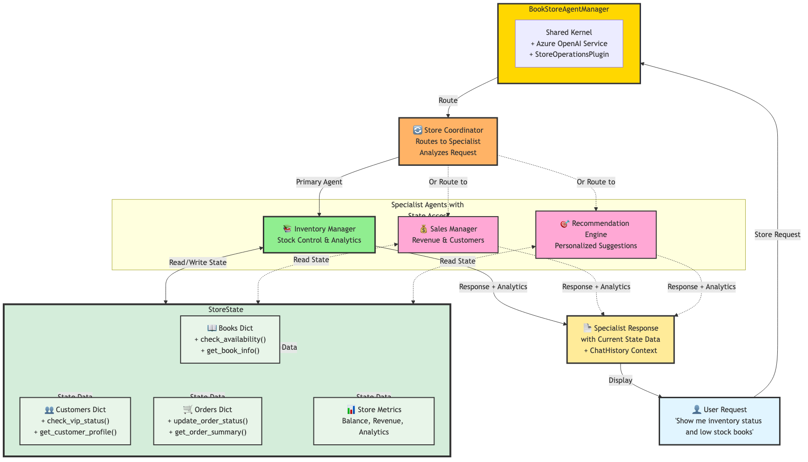

# 🏪 Modern Book Store Multi-Agent System - State Management Demo

## 🎯 Learning Objectives

This demo teaches you how to:

* Implement **shared state management** using Semantic Kernel's modern features
* Use **KernelBaseModel** for data validation and state representation
* Coordinate multiple specialized agents with **intelligent routing**
* Build **context-aware AI systems** with real-time state updates
* Leverage **kernel functions** for state operations and analytics

---

## 🏗️ Modern System Architecture



Modern bookstore system with four intelligent agents (Inventory, Sales, Recommendation, Coordinator) sharing state through KernelBaseModel with real-time analytics and kernel function integration.

---

## 🏗️ Modern System Architecture

### 🧩 Advanced State Management

The system uses a central `StoreState` class with **KernelBaseModel** that manages:

* **📚 Book Inventory** – Available books with real-time stock tracking
* **👥 Customer Database** – Customer profiles with spending analytics
* **📦 Order Management** – Complete order lifecycle and tracking
* **💰 Financial Analytics** – Store balance, revenue, and performance metrics

---

### 🤖 Four Intelligent Agents

1. **📚 Inventory Manager** – Real-time stock control and inventory optimization
2. **💰 Sales Manager** – Revenue strategies and customer relationship management
3. **🎯 Recommendation Engine** – AI-powered personalized book suggestions
4. **🔄 Store Coordinator** – Intelligent request routing and agent collaboration

---

### 🧱 KernelBaseModel for Data Integrity

```python
class Book(KernelBaseModel):
    book_id: str
    title: str
    author: str
    genre: str
    price: float
    quantity: int
    is_bestseller: bool
    
    @kernel_function(name="check_availability")
    def check_availability(self) -> bool:
        return self.quantity > 0
```

---

## 🚀 Running the Modern Demo

### 1️⃣ Prerequisites

```bash
pip install semantic-kernel==1.37.0 python-dotenv
```

### 2️⃣ Environment Setup

Create a `.env` file:

```env
AZURE_TEXTGENERATOR_DEPLOYMENT_NAME=your-deployment-name
AZURE_TEXTGENERATOR_DEPLOYMENT_ENDPOINT=https://your-resource.openai.azure.com/
AZURE_TEXTGENERATOR_DEPLOYMENT_KEY=your-api-key
```

### 3️⃣ Run the Modern Demo

```bash
python modern_bookstore_demo.py
```

---

## 📊 Modern Demo Workflow

### Step 1: System Initialization

* Creates shared store state with **enhanced sample data**
* Initializes **four specialized agents** with modern framework
* Sets up **kernel functions** for state operations
* Configures **intelligent coordinator** for request routing

### Step 2: Real-time State Display

Shows comprehensive store analytics:

```
📊 STORE ANALYTICS:
• Store Balance: $0.00
• Today's Revenue: $0.00
• Total Book Copies: 43
• Book Types: 6
• Inventory Value: $678.82
• Customers: 4
• VIP Customers: 1
• Total Orders: 0
```

### Step 3: Intelligent Scenario Processing

The system processes enhanced scenarios with **AI-powered coordination**:

* **🔄 Dynamic Routing:** "We're running low on Fiction books" → Inventory Manager
* **💰 Revenue Optimization:** "Boost slow sales" → Sales Manager  
* **🎯 Personalized Matching:** "Business and Non-Fiction lover" → Recommendation Engine
* **📈 Strategic Planning:** "VIP customer engagement" → Multi-agent collaboration

### Step 4: Real-time State Updates

Between scenarios, the system simulates **automated business operations**:

* **Smart order processing** with kernel functions
* **Real-time inventory updates** with stock validation
* **Customer spending analytics** with VIP status tracking
* **Revenue calculations** with daily tracking

### Step 5: Enhanced Final Analytics

Shows **comprehensive state evolution** with detailed metrics and session analytics.

---

## 🔧 Modern Key Features

### 🧠 Advanced State Management

* All agents access the same `StoreState` instance with **kernel function integration**
* **Real-time state updates** with immediate visibility across all agents
* **Automated analytics** with comprehensive store metrics
* **KernelBaseModel validation** with business rule enforcement

### ✅ Kernel Function Integration

* **@kernel_function decorators** for all state operations
* **Automatic function registration** with the kernel
* **Structured data access** patterns with validation
* **Plugin-based architecture** for extensibility

### 👥 Intelligent Agent Coordination

* **Specialized domain expertise** with modern agent framework
* **AI-powered request routing** through coordinator agent
* **Context-aware responses** with real-time state data
* **Inter-agent collaboration** for complex scenarios

### 📊 Real-time Analytics

* **Comprehensive store metrics** with kernel functions
* **Automated reporting** with formatted analytics
* **Performance tracking** across all business areas
* **VIP customer identification** with spending analytics

---

## 🎪 Modern Sample Output

```
📨 Store Request: We're running low on Fiction books, what should we restock?
🔄 Analyzing and coordinating with specialists...
✅ Coordination Decision:
   Primary Agent: inventory
   Supporting Agents: sales
   Reasoning: Inventory management is primary, sales can provide customer demand insights

🔧 Engaging inventory specialist...

🎯 STORE REQUEST PROCESSING COMPLETE
Handled by: Inventory Manager
Supporting: sales
Session: 2 messages
======================================================================
📚 **Inventory Management Analysis**

Based on current inventory analytics, here are my recommendations:

📊 CURRENT INVENTORY STATUS:
• Fiction books: 3 titles, 35 copies total
• Low stock alerts: 2 titles need immediate attention
• Bestsellers: 2 Fiction titles performing well

🚨 RESTOCKING PRIORITIES:
1. "The Hobbit" - COMPLETELY OUT OF STOCK (Fantasy genre)
2. "Sapiens" - CRITICALLY LOW (3 copies remaining)

💡 RECOMMENDATIONS:
• Order 20+ copies of "The Hobbit" - high customer demand
• Restock "Sapiens" with 15+ copies - Non-Fiction bestseller
• Consider expanding Fantasy section based on customer preferences

Using sales data: VIP customers show strong Fiction preference - prioritize these genres.
======================================================================
```

---

## 💡 Modern Learning Points

### 🧩 Advanced State Management Patterns

* **KernelBaseModel Integration:** Modern data modeling with kernel function support
* **Centralized State:** Single source of truth with real-time analytics
* **Immutable Updates:** Kernel function validation ensures data consistency
* **Observable Changes:** Real-time state tracking across all agents

### ⚙️ Modern Multi-Agent Coordination

* **Intelligent Routing:** AI-powered request distribution to optimal agents
* **Parallel Processing:** Async/await patterns for concurrent agent operations
* **Shared Context:** Common state with kernel function access
* **Specialized Expertise:** Domain-specific agents with modern framework

### 🛠️ Semantic Kernel 1.37.0 Features

* **ChatCompletionAgent Framework:** Modern agent patterns with structured instructions
* **Kernel Function Decorators:** Proper function registration and access
* **Plugin Architecture:** Modular and extensible system design
* **InProcessRuntime:** Efficient resource management and lifecycle

### 🌍 Real-World Applications

* **E-commerce Intelligence:** Multi-agent systems for online retail
* **Inventory Optimization:** Real-time stock management and forecasting
* **Customer Analytics:** Personalized recommendations and engagement
* **Business Intelligence:** Comprehensive analytics and reporting

---

## 🔄 Modern Extension Ideas

* **🔗 External API Integration:** Connect to real book databases and inventory systems
* **📱 Web Dashboard:** Real-time visualization of store state and agent activities
* **🤖 Additional Agents:** Add shipping, marketing, or finance specialists
* **📈 Machine Learning:** Predictive analytics for inventory and sales forecasting
* **🔐 Authentication:** Customer login and personalized shopping experiences
* **💳 Payment Integration:** Real transaction processing with order management

---

## 🛠️ Modern Technical Stack

* **Python 3.8+** – Core programming language with async/await support
* **Semantic Kernel 1.37.0** – Modern AI orchestration framework with agent support
* **Azure OpenAI** – Advanced LLM integration for intelligent agents
* **KernelBaseModel** – Modern data validation and kernel function integration
* **Asyncio** – High-performance concurrent agent processing
* **Plugin Architecture** – Modular and extensible system design

---

## 🚀 Getting Started with Modern Features

### Understanding KernelBaseModel
```python
class Customer(KernelBaseModel):
    customer_id: str
    name: str
    total_spent: float = 0.0
    
    @kernel_function(name="check_vip_status")
    def check_vip_status(self) -> bool:
        return self.total_spent > 500
```

### Working with Modern Agents
```python
agent = ChatCompletionAgent(
    kernel=kernel,
    name="Inventory_Manager",
    description="Specialist in book inventory management",
    instructions="Use inventory data to provide expert recommendations..."
)
```

### Implementing Kernel Functions
```python
@kernel_function(
    name="get_store_analytics",
    description="Get comprehensive store analytics"
)
def get_store_analytics(self) -> str:
    # Real-time analytics implementation
    return formatted_analytics
```

---

## 🎯 Success Metrics

Your modern system is working when:

* ✅ All four agents respond to coordinated requests
* ✅ Kernel functions provide real-time analytics and state operations
* ✅ State updates are immediately visible across all agents
* ✅ Intelligent routing directs requests to optimal specialists
* ✅ Business operations automatically update the shared state
* ✅ Comprehensive analytics show evolving store performance

---