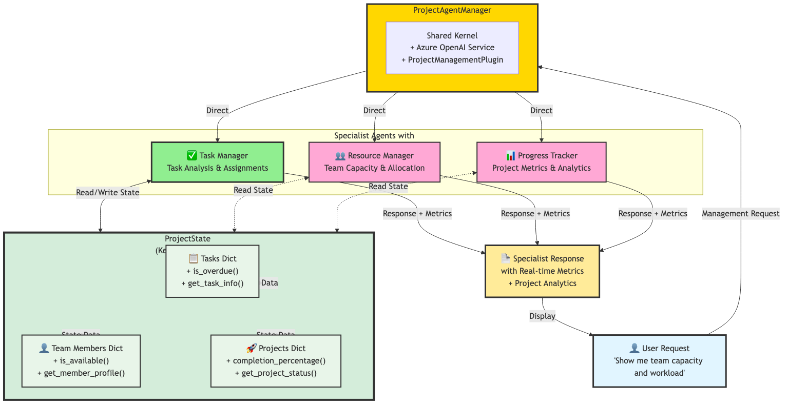

# 🧠 Project Management System — Complete Solution

## 🎉 Solution Overview

This complete **project management system** demonstrates sophisticated **state management** with **KernelBaseModel** and **multi-agent collaboration** using **Semantic Kernel 1.37.0** for intelligent project management.

---

## 🏗️ System Architecture



This diagram shows the complete Project Management multi-agent system architecture featuring:
- **ProjectAgentManager** with shared kernel and ProjectManagementPlugin
- **Three Specialist Agents**: Task Manager, Resource Manager, and Progress Tracker
- **ProjectState (KernelBaseModel)** managing Tasks, Team Members, and Projects
- Direct routing to specialists with bidirectional state access for real-time project analytics

---

## 🏗️ System Architecture

### 🧩 Three Core KernelBaseModel Models

1. **📋 Task Model** — Manages individual tasks with kernel functions and validation
2. **👥 TeamMember Model** — Tracks team capacity, skills, and availability with kernel functions
3. **📊 Project Model** — Coordinates projects with progress tracking and analytics

---

### 🧠 Shared State Management with Kernel Functions

* **`ProjectState`** — Centralized state managing all entities with kernel functions
* **`ProjectManagementPlugin`** — Plugin exposing state operations to kernel
* **Real-time Updates** — All agents see immediate changes through shared state
* **Data Validation** — KernelBaseModel ensures data integrity with proper typing

---

### 🤖 Three Specialist Agents

1. **📋 Task Manager** — Manages task distribution, priorities, and deadlines using kernel functions
2. **👥 Resource Manager** — Optimizes team allocation, capacity, and workload balancing
3. **📈 Progress Tracker** — Tracks metrics, provides data-driven insights and analytics

---

## 🔧 Key Implementation Details

### ✅ Robust KernelBaseModel Implementation

**Task Model Features**

* Status and priority validation
* Overdue task detection with `check_task_overdue()` kernel function
* Formatted task information with `get_task_info()` kernel function

**TeamMember Model Features**

* Capacity tracking with `get_task_count()` kernel function (max 5 tasks)
* Availability checking with `check_member_availability()` kernel function  
* Skill inventory and profile generation

**Project Model Features**

* Completion percentage calculation with kernel function
* Overdue task identification with kernel function
* Progress tracking and status reporting

---

### 🧠 Intelligent Agent System

**Task Manager Agent**

* Task distribution analysis using `get_task_metrics`
* Priority assessment and deadline management
* Risk identification and mitigation strategies

**Resource Manager Agent**

* Workload balancing using `get_team_capacity`
* Skill utilization and optimization
* Capacity planning and allocation

**Progress Tracker Agent**

* Milestone tracking using `get_project_progress`
* Performance insights and trend identification
* Bottleneck identification and acceleration strategies

---

### 🧱 Realistic Sample Data with Kernel Functions

The system initializes using kernel functions with:

* 4 team members with diverse roles and skills (Project Manager, Developer, Designer, DevOps)
* 8 tasks across different statuses and priorities with realistic due dates
* 1 active project with comprehensive task assignments
* Mixed completion states for demonstration purposes

---

## 🚀 Running the Solution

### 1️⃣ Install Dependencies

```bash
pip install semantic-kernel==1.37.0 python-dotenv
```

---

### 2️⃣ Configure Environment

Create a `.env` file:

```env
AZURE_TEXTGENERATOR_DEPLOYMENT_NAME=your-deployment-name
AZURE_TEXTGENERATOR_DEPLOYMENT_ENDPOINT=https://your-resource.openai.azure.com/
AZURE_TEXTGENERATOR_DEPLOYMENT_KEY=your-api-key
```

---

### 3️⃣ Run the Solution

```bash
python project_management_solution.py
```

---

## 📊 Sample Output

```text
🏢 MODERN PROJECT MANAGEMENT SYSTEM
Multi-Agent State Management Demo
Semantic Kernel 1.37.0 with Advanced Agent Framework
======================================================================

📊 INITIAL PROJECT STATE:
📊 PROJECT MANAGEMENT DASHBOARD:
• Projects: 1 total (1 active, 0 completed)
• Tasks: 8 total (1 completed, 1 overdue)
• Team: 4 members
• Overall Completion: 12.5%
• System Status: 🟢 Operational

🚀 Starting multi-agent project management demonstrations...
Available Agents: Task Manager, Resource Manager, Progress Tracker
Available Functions: Task Metrics, Team Capacity, Project Progress, Status Tracking

🎯 PROJECT REQUEST PROCESSING COMPLETE
Handled by: Task Manager
Supporting: None
Session: 2 messages

======================================================================
📋 Task Management Analysis

Based on the current project metrics, I can provide the following analysis:

📊 Task Distribution:
• Total Tasks: 8
• Completed: 1 (12.5%)
• In Progress: 3
• Overdue: 1 (Deployment Setup)
• Todo: 3

🚨 Priority Assessment:
• Critical: 2 tasks (API Development, Security Audit)
• High: 2 tasks (Project Planning, UI Design) 
• Medium: 3 tasks
• Low: 1 task

Recommendations:
1. Immediately address the overdue "Deployment Setup" task
2. Focus on the 2 critical priority tasks due within 5 days
3. Consider reassigning some medium-priority tasks to balance workload
...
======================================================================
```

---

## 🎯 Learning Outcomes

### 1️⃣ Modern State Management

* Centralized state with KernelBaseModel and kernel functions
* Real-time updates across all agents through shared plugins
* Comprehensive project analytics and metrics tracking

### 2️⃣ Advanced Multi-Agent Coordination

* Domain-specific agent expertise with kernel function access
* Direct agent access with specialized capabilities
* Collaborative problem-solving with shared context

### 3️⃣ Semantic Kernel 1.37.0 Mastery

* KernelBaseModel for state management
* ChatCompletionAgent framework usage
* Plugin-based kernel function organization
* Modern agent runtime patterns

### 4️⃣ Practical Project Management

* Data-driven task prioritization and assignment
* Resource capacity planning with analytics
* Progress monitoring and risk assessment
* Actionable recommendations based on metrics

---

## 🔄 Extension Opportunities

### 💡 Additional Features

* **Time Tracking:** Add hours spent on tasks with kernel functions
* **Dependencies:** Track task dependencies and critical paths
* **Budget Tracking:** Manage project budgets and costs
* **Advanced Reporting:** Generate automated reports with analytics
* **External Integration:** Connect with tools like Jira or Trello via plugins

### ⚙️ Enhanced Agents

* **RiskAgent:** Proactive risk identification and mitigation
* **QualityAgent:** Code quality and testing oversight
* **StakeholderAgent:** Client communication and reporting management

### 📈 Advanced Analytics

* Predictive completion dates using historical data
* Team performance metrics and velocity tracking
* Resource optimization algorithms
* Burn-down charts and sprint planning

---

## 💡 Best Practices Demonstrated

### 🧱 Modern Code Organization

* Clear separation with KernelBaseModel and plugins
* Consistent kernel function naming and documentation
* Comprehensive type hints throughout
* Proper error handling and state validation

### 🧠 Advanced State Management

* Immutable data models with KernelBaseModel
* Centralized updates through kernel functions
* Validation at model level with proper typing
* Computed properties for derived analytics

### 🤖 Professional Agent Design

* Specialized domain expertise with data access
* Clear prompt engineering for practical outputs
* Consistent response formats and branding
* Actionable, data-driven recommendations

---

## 🏆 Success Metrics

The solution successfully demonstrates:

* ✅ **Complete Modern Architecture:** KernelBaseModel, plugins, and agents working together
* ✅ **Intelligent Multi-Agent Collaboration:** Specialized agents with kernel function access
* ✅ **Realistic Project Scenarios:** Practical simulations with comprehensive analytics
* ✅ **Scalable Plugin Architecture:** Easy to extend with new kernel functions
* ✅ **Educational Value:** Clear progression from basic to advanced Semantic Kernel patterns

---

## 🧩 Exercise Summary

This exercise transforms learners from understanding **basic agent concepts** to implementing a **complete modern project management system** with advanced **multi-agent coordination** using Semantic Kernel 1.37.0.

### 🪜 Key Learning Progression

1. **Starter:** Basic structure with TODOs for KernelBaseModel and kernel functions
2. **Implementation:** Building models, state management, and agents step-by-step with modern patterns
3. **Solution:** Fully working system with advanced features, analytics, and best practices using latest Semantic Kernel framework

---

## 🚀 Next Steps

After mastering this solution, consider:

* Integrating with real project management tools
* Adding more sophisticated analytics and forecasting
* Implementing user interfaces and dashboards
* Scaling to enterprise-level project portfolio management
* Exploring additional AI capabilities like predictive analytics

---

**Congratulations on building a modern AI-powered project management system! 🎉**