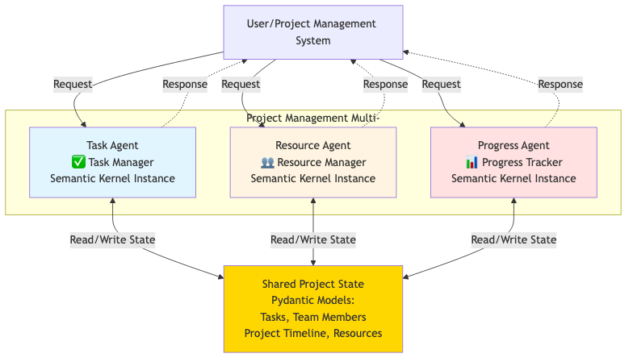

# 🧩 Project Management System — Multi-Agent State Management Exercise

## 🎯 Exercise Overview

Transform this starter code into a complete **project management system** using **Semantic Kernel 1.37.0**!
You'll implement **state management with KernelBaseModel** and create **specialized agents** for intelligent project coordination.

---

## 🏗️ System Architecture



Target architecture for the Project Management system you'll build featuring:
- **ProjectAgentManager** with shared kernel and ProjectManagementPlugin
- **Three Specialist Agents**: Task Manager, Resource Manager, and Progress Tracker
- **ProjectState (KernelBaseModel)** managing Tasks, Team Members, and Projects
- Direct routing to specialists with bidirectional state access for real-time project analytics

---

## 📋 Exercise Tasks

### 🧱 Task 1: Implement KernelBaseModel Models

**File:** `project_management_starter.py`

---

#### 1.1 Complete the `Task` Model

```python
class Task(KernelBaseModel):
    task_id: str
    title: str
    description: str
    status: str  # todo, in_progress, review, done
    priority: str  # low, medium, high, critical
    assignee: Optional[str]  # member_id
    due_date: datetime
```

**Add kernel functions:**

* `check_task_overdue()`: Check if task is overdue
* `get_task_info()`: Return formatted task information

**Add validators:**

* `status` must be one of: `todo`, `in_progress`, `review`, `done`
* `priority` must be one of: `low`, `medium`, `high`, `critical`

---

#### 1.2 Complete the `TeamMember` Model

```python
class TeamMember(KernelBaseModel):
    member_id: str
    name: str
    role: str
    skills: List[str]
    current_tasks: List[str]  # task_ids
```

**Add kernel functions:**

* `get_task_count()`: Returns number of assigned tasks
* `check_member_availability()`: Check if member has capacity
* `get_member_profile()`: Return formatted member information

---

#### 1.3 Complete the `Project` Model

```python
class Project(KernelBaseModel):
    project_id: str
    name: str
    description: str
    status: str  # planning, active, on_hold, completed
    tasks: List[str]  # task_ids
    team_members: List[str]  # member_ids
```

**Add kernel functions:**

* `calculate_completion_percentage()`: Calculate % of completed tasks
* `get_overdue_tasks()`: Return list of overdue tasks
* `get_project_status()`: Return comprehensive project status

**Add validators:**

* `status` must be one of: `planning`, `active`, `on_hold`, `completed`

---

### 🧩 Task 2: Implement `ProjectState` with Kernel Functions

**File:** `project_management_starter.py`

Complete the `ProjectState` class with:

**Fields:**

* `projects`, `team_members`, `tasks` — all `Dict`

**Kernel Functions:**

* `add_project(project: Project) -> str`
* `add_team_member(member: TeamMember) -> str`
* `add_task(task: Task) -> str`
* `update_task_status(task_id: str, status: str) -> str`
* `get_project_status_summary()`: returns comprehensive dashboard

---

### 🤖 Task 3: Complete the ProjectOperationsPlugin

**File:** `project_management_starter.py`

#### 3.1 Implement Project Operations Plugin

Create kernel functions for:
* `get_task_metrics()`: Comprehensive task statistics
* `get_team_capacity()`: Team workload analysis  
* `get_project_progress()`: Progress analytics

#### 3.2 Enhance Agent Instructions

Update all agents to use the new kernel functions and provide data-driven responses.

#### 3.3 Implement `ProgressAgent`

* Tracks project progress and metrics using kernel functions
* Provides progress analysis and data-driven recommendations

---

### 🏗️ Task 4: Complete `ProjectAgentManager`

**File:** `project_management_starter.py`

#### 4.1 Initialize Sample Data with Kernel Functions

In `_initialize_sample_data()`:

* 4 team members with different roles and skills
* 8-10 tasks with different statuses and priorities
* 1-2 projects with associated tasks and team members
* Use `add_team_member`, `add_task`, `add_project` kernel functions

#### 4.2 Register ProjectOperationsPlugin

* Properly register the plugin with the kernel
* Ensure all kernel functions are accessible to agents

#### 4.3 Enhance Coordination Logic

Improve `_parse_coordination_decision()` to properly parse agent routing decisions.

#### 4.4 Implement Project Operation Simulation

`simulate_project_operation()` should:
* Use kernel functions to update task status
* Show before/after metrics using project analytics

---

## 🛠️ Setup Instructions

### 1️⃣ Install Dependencies

```bash
pip install semantic-kernel==1.37.0 python-dotenv
```

### 2️⃣ Configure Environment

Create a `.env` file with your Azure OpenAI credentials:

```env
AZURE_TEXTGENERATOR_DEPLOYMENT_ENDPOINT=https://your-resource.openai.azure.com/
AZURE_TEXTGENERATOR_DEPLOYMENT_KEY=your-api-key
AZURE_TEXTGENERATOR_DEPLOYMENT_NAME=your-deployment-name
```

### 3️⃣ Run Starter Code

```bash
python project_management_starter.py
```

---

## 💡 Implementation Hints

### For KernelBaseModel Models

```python
@kernel_function(
    name="check_task_overdue",
    description="Check if the task is overdue"
)
def is_overdue(self) -> bool:
    return self.status != 'done' and self.due_date < datetime.now()

@property
def task_count(self) -> int:
    return len(self.current_tasks)
```

---

### For ProjectState with Kernel Functions

```python
@kernel_function(
    name="add_task_to_system",
    description="Add or update task in the system"
)
def add_task(self, task: Task) -> str:
    self.tasks[task.task_id] = task
    return f"✅ Added task '{task.title}' to system"
```

---

### For Project Operations Plugin

```python
@kernel_function(
    name="get_task_metrics",
    description="Get comprehensive task metrics and statistics"
)
def get_task_metrics(self) -> str:
    # Implement metrics calculation using project_state
    return formatted_metrics_string
```

---

### For Sample Data

Create realistic sample data using kernel functions:

* **Team Members:** Project Manager, Developer, Designer, DevOps
* **Tasks:** Varying priorities, statuses, and realistic due dates
* **Projects:** Active project with comprehensive task list

---

## 🧪 Testing Your Solution

After completing all tasks, your system should:

* Display comprehensive project dashboard with actual metrics
* Process scenarios with data-driven agent responses using kernel functions
* Simulate state changes using proper kernel function calls
* Track progress metrics across projects using analytics
* Handle intelligent agent coordination and routing

---

## 📊 Expected Output

```text
🏢 MODERN PROJECT MANAGEMENT SYSTEM
Multi-Agent State Management Exercise
Semantic Kernel 1.37.0 with Advanced Agent Framework
======================================================================

📊 INITIAL PROJECT STATE:
📊 PROJECT MANAGEMENT DASHBOARD:
• Projects: 1 total (1 active, 0 completed)
• Tasks: 8 total (1 completed, 1 overdue)
• Team: 4 members
• Overall Completion: 12.5%
• System Status: 🟢 Operational

🚀 Starting multi-agent project management exercise...
Available Agents: Task Manager, Resource Manager, Project Coordinator
TODO: Implement Progress Tracker agent

🎯 PROJECT REQUEST PROCESSING COMPLETE
Handled by: Task Manager
Supporting: None
Session: 2 messages

======================================================================
📋 Task Management Analysis

Analysis based on current project metrics:
• 7 pending tasks with 1 overdue
• Priority distribution: 2 critical, 2 high, 3 medium, 1 low
• Recommended actions for overdue task reassignment...
======================================================================
```

---

## ✅ Success Criteria

Your solution is complete when:

* [x] All KernelBaseModel models are implemented with kernel functions
* [x] `ProjectState` manages all entities with proper kernel functions
* [x] ProjectOperationsPlugin provides comprehensive analytics
* [x] All four agents provide data-driven, context-aware analysis
* [x] Sample data initializes using kernel functions
* [x] State changes are visible during simulations using project analytics
* [x] Progress tracking works across all scenarios with kernel functions

---

## 🆘 Need Help?

If you get stuck:

* Review **Semantic Kernel 1.37.0 documentation** for KernelBaseModel and agents
* Check **kernel function decorators** for proper registration
* Start with simple models and gradually add kernel functions
* Test each kernel function independently before agent integration
* Use the coordination agent to understand request routing

---

**Good luck! 🚀**

---
