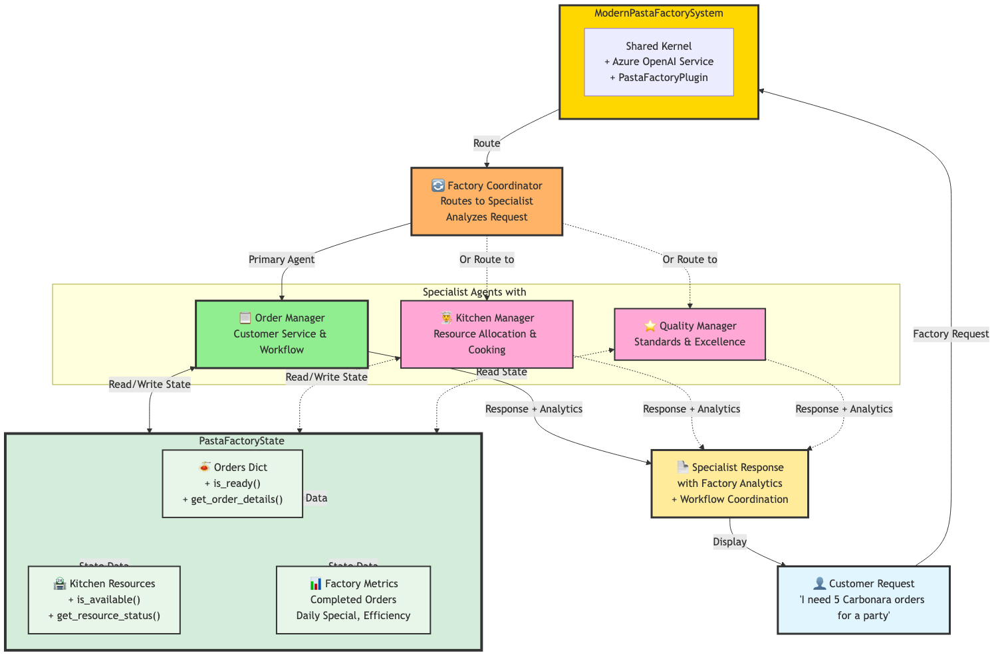

# 🍝 Modern Pasta Factory Multi-Agent System - State Coordination Demo

## 🎯 Learning Objectives

This demo teaches you how to:

* Implement **multi-agent orchestration** using Semantic Kernel's modern agent framework
* Use **KernelBaseModel** for state representation and data validation in manufacturing scenarios
* Coordinate **specialized factory agents** with intelligent request routing
* Build **context-aware AI systems** with real-time production state updates
* Leverage **kernel functions** for factory operations and production analytics

---

## 🏗️ Modern System Architecture



This diagram shows the complete Pasta Factory multi-agent system architecture featuring:
- **ModernPastaFactorySystem** with shared kernel and PastaFactoryPlugin
- **Factory Coordinator** for intelligent request routing and agent collaboration
- **Three Specialist Agents**: Order Manager, Kitchen Manager, and Quality Manager
- **PastaFactoryState (KernelBaseModel)** managing Orders, Kitchen Resources, and Factory Metrics
- Coordinator-based routing with bidirectional state access for real-time production analytics

---

## 🏗️ Modern System Architecture

### 🧩 Advanced State Management

The system uses a central `PastaFactoryState` class with **KernelBaseModel** that manages:

* **🍝 Order Pipeline** – Complete order lifecycle from received to served
* **👨‍🍳 Kitchen Resources** – Resource allocation and capacity tracking
* **📊 Production Analytics** – Efficiency metrics and completion rates
* **⭐ Quality Standards** – Authentic Italian recipe compliance tracking

---

### 🤖 Four Intelligent Factory Agents

1. **📝 Order Manager** – Order prioritization and customer service coordination
2. **👨‍🍳 Kitchen Manager** – Resource optimization and cooking process management
3. **⭐ Quality Manager** – Authentic Italian standards and recipe excellence
4. **🔄 Factory Coordinator** – Intelligent request routing and multi-agent collaboration

---

### 🧱 KernelBaseModel for Production Integrity

```python
class PastaOrder(KernelBaseModel):
    order_id: str
    customer_name: str
    pasta_type: str
    sauce: str
    status: str
    order_date: datetime
    
    def is_ready(self) -> bool:
        return self.status == 'ready'
```

---

## 🚀 Running the Modern Demo

### 1️⃣ Prerequisites

```bash
pip install semantic-kernel==1.37.0 python-dotenv
```

### 2️⃣ Environment Setup

Create a `.env` file:

```env
AZURE_DEPLOYMENT_NAME=your-deployment-name
AZURE_DEPLOYMENT_ENDPOINT=https://your-resource.openai.azure.com/
AZURE_DEPLOYMENT_KEY=your-api-key
```

### 3️⃣ Run the Modern Demo

```bash
python modern_pasta_factory_demo.py
```

---

## 📊 Modern Demo Workflow

### Step 1: Factory Initialization

* Creates shared factory state with **comprehensive kitchen resources**
* Initializes **four specialized agents** with modern framework
* Sets up **kernel functions** for factory operations and analytics
* Configures **intelligent coordinator** for production request routing

### Step 2: Real-time Factory Status Display

Shows comprehensive production analytics:

```
🍝 PASTA FACTORY STATUS:
• Orders: 5 total (5 active, 0 completed)
• Resources: 5/5 available
• Daily Special: Spaghetti Carbonara
• Efficiency: 0.0%
```

### Step 3: Intelligent Scenario Processing

The system processes enhanced scenarios with **AI-powered coordination**:

* **🔄 Dynamic Routing:** "Multiple orders waiting" → Order Manager with Kitchen & Quality support
* **👨‍🍳 Resource Optimization:** "Kitchen getting busy" → Kitchen Manager with Quality support
* **⭐ Quality Assurance:** "Authentic Italian standards" → Quality Manager
* **📈 Production Planning:** "Dinner rush preparation" → Multi-agent collaboration

### Step 4: Real-time Production Updates

Between scenarios, the system simulates **automated factory operations**:

* **Order processing** through sequential workflow stages
* **Resource allocation** and capacity management
* **Quality validation** at each production stage
* **Efficiency tracking** with real-time metrics

### Step 5: Enhanced Final Analytics

Shows **comprehensive production evolution** with detailed factory metrics and session analytics.

---

## 🔧 Modern Key Features

### 🧠 Advanced Production State Management

* All agents access the same `PastaFactoryState` instance with **kernel function integration**
* **Real-time state updates** with immediate visibility across all agents
* **Automated production analytics** with comprehensive factory metrics
* **KernelBaseModel validation** with manufacturing rule enforcement

### ✅ Kernel Function Integration

* **@kernel_function decorators** for all factory operations
* **Automatic function registration** with the kernel through dedicated plugin
* **Structured data access** patterns with production validation
* **Plugin-based architecture** for extensible factory operations

### 👥 Intelligent Agent Coordination

* **Specialized domain expertise** with modern agent framework
* **AI-powered request routing** through coordinator agent
* **Context-aware responses** with real-time production data
* **Inter-agent collaboration** for complex manufacturing scenarios

### 📊 Real-time Production Analytics

* **Comprehensive factory metrics** with kernel functions
* **Order status tracking** with visual progress indicators
* **Resource utilization** monitoring and capacity planning
* **Quality compliance** tracking with authentic standards

---

## 🎪 Modern Sample Output

```
📨 Factory Request: We have multiple orders waiting. What's the current status and how should we prioritize?
🔄 Analyzing and coordinating with specialists...
✅ Coordination Decision:
   Primary Agent: orders
   Supporting Agents: kitchen, quality
   Reasoning: The status indicates multiple active orders waiting. The orders agent should manage workflow and prioritization, while kitchen allocates resources and quality ensures standards.

🔧 Engaging orders specialist...

🎯 FACTORY REQUEST PROCESSING COMPLETE
Handled by: Order Manager
Supporting: kitchen, quality
Session: 2 messages
======================================================================
📝 **Order Management Analysis**

Based on current factory metrics, here are my recommendations:

📊 CURRENT ORDER STATUS:
• Total Orders: 5 active
• Status: All orders in 'received' status
• Popular Types: Spaghetti, Fettuccine, Penne
• Daily Special: Spaghetti Carbonara

🚨 PRIORITIZATION STRATEGY:
1. Focus on Daily Special first for efficiency
2. Batch similar pasta types for optimized cooking
3. Allocate kitchen resources based on order complexity

💡 WORKFLOW OPTIMIZATION:
• Start with Spaghetti Carbonara orders
• Use pasta maker station for fresh pasta preparation
• Coordinate sauce station for parallel processing
• Quality checks at each production stage

🍝 AUTHENTIC ITALIAN INSIGHTS:
• Ensure proper al dente cooking for all pasta
• Use traditional techniques for sauce preparation
• Maintain authentic ingredient standards
======================================================================
```

---

## 💡 Modern Learning Points

### 🧩 Advanced State Management Patterns

* **KernelBaseModel Integration:** Modern data modeling for manufacturing scenarios
* **Centralized Production State:** Single source of truth with real-time factory analytics
* **Workflow Validation:** Production stage transitions with business rule enforcement
* **Observable Changes:** Real-time state tracking across all factory agents

### ⚙️ Modern Multi-Agent Coordination

* **Intelligent Routing:** AI-powered request distribution to optimal production specialists
* **Parallel Processing:** Async/await patterns for concurrent agent operations in manufacturing
* **Shared Production Context:** Common state with kernel function access for all agents
* **Specialized Manufacturing Expertise:** Domain-specific agents with modern framework

### 🛠️ Semantic Kernel 1.37.0 Features

* **ChatCompletionAgent Framework:** Modern agent patterns with structured manufacturing instructions
* **Kernel Function Decorators:** Proper function registration and access through plugins
* **Plugin Architecture:** Modular and extensible factory system design
* **InProcessRuntime:** Efficient resource management for production workflows

### 🌍 Real-World Applications

* **Manufacturing Intelligence:** Multi-agent systems for production optimization
* **Resource Allocation:** Real-time kitchen resource management and capacity planning
* **Quality Assurance:** Automated standards compliance and recipe validation
* **Production Analytics:** Comprehensive manufacturing metrics and performance tracking

---

## 🔄 Modern Extension Ideas

* **🔗 Supply Chain Integration:** Connect to ingredient suppliers and inventory systems
* **📱 Production Dashboard:** Real-time visualization of factory state and agent activities
* **🤖 Additional Agents:** Add procurement, logistics, or customer service specialists
* **📈 Predictive Analytics:** Demand forecasting and production planning optimization
* **🔐 Authentication:** Staff login and role-based access to factory operations
* **💳 Order Integration:** Real customer order processing with payment systems

---

## 🛠️ Modern Technical Stack

* **Python 3.8+** – Core programming language with async/await support
* **Semantic Kernel 1.37.0** – Modern AI orchestration framework with agent support
* **Azure OpenAI** – Advanced LLM integration for intelligent factory agents
* **KernelBaseModel** – Modern data validation for manufacturing scenarios
* **Asyncio** – High-performance concurrent agent processing
* **Plugin Architecture** – Modular and extensible factory system design

---

## 🚀 Getting Started with Modern Features

### Understanding KernelBaseModel for Manufacturing
```python
class KitchenResource(KernelBaseModel):
    resource_id: str
    name: str
    capacity: int
    current_usage: int = 0
    
    def is_available(self) -> bool:
        return self.current_usage < self.capacity
```

### Working with Modern Factory Agents
```python
agent = ChatCompletionAgent(
    kernel=kernel,
    name="Kitchen_Manager",
    description="Specialist in kitchen resource management",
    instructions="Use kitchen capacity data to optimize resource allocation..."
)
```

### Implementing Factory Kernel Functions
```python
@kernel_function(
    name="get_kitchen_capacity",
    description="Get kitchen resource capacity analysis"
)
def get_kitchen_capacity(self) -> str:
    # Real-time kitchen analytics implementation
    return formatted_capacity_analysis
```

---

## 🎯 Success Metrics

Your modern pasta factory system is working when:

* ✅ All four agents respond to coordinated production requests
* ✅ Kernel functions provide real-time factory analytics and operations
* ✅ Production state updates are immediately visible across all agents
* ✅ Intelligent routing directs requests to optimal manufacturing specialists
* ✅ Factory operations automatically update the shared production state
* ✅ Comprehensive analytics show evolving factory performance and efficiency

---

## 🍝 Authentic Italian Excellence

This demo showcases how modern AI orchestration can enhance traditional manufacturing processes while maintaining authentic standards. The system demonstrates how **multi-agent coordination** and **real-time state management** can optimize production workflows while preserving the artisanal quality of authentic Italian pasta preparation.

**Buon appetito! 🍝**