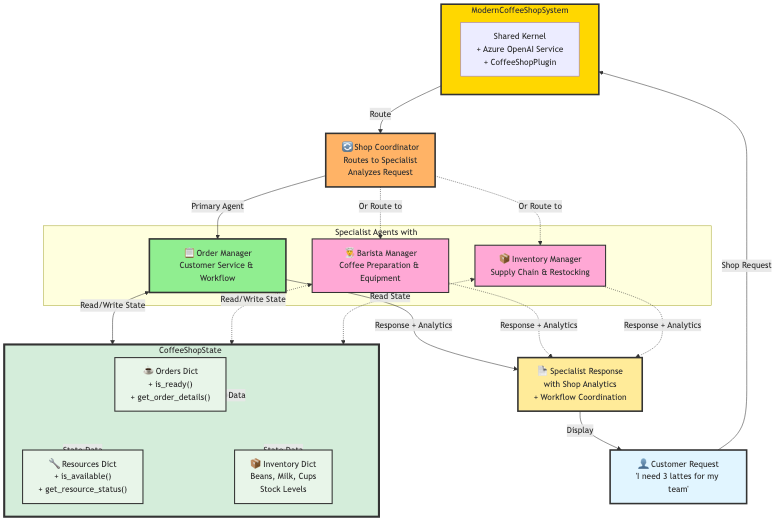

# ☕ Modern Coffee Shop Multi-Agent System - Complete Solution

## 🎉 Solution Overview
This complete **modern coffee shop system** demonstrates sophisticated **state management** with **KernelBaseModel** and **intelligent multi-agent coordination** using **Semantic Kernel 1.37.0** for optimized coffee shop operations.

---

## 🏗️ Modern System Architecture



Modern coffee shop system with four intelligent agents (Order Manager, Barista Manager, Inventory Manager, Shop Coordinator) sharing state through KernelBaseModel with real-time production analytics and kernel function integration.

---

## 🏗️ Modern System Architecture

### 🧩 Advanced State Management

The system uses a central `CoffeeShopState` class with **KernelBaseModel** that manages:

* **☕ Order Pipeline** – Complete order lifecycle from received to served with kernel functions
* **🔧 Equipment Resources** – Resource allocation and capacity tracking with availability checks
* **📊 Production Analytics** – Efficiency metrics and completion rates with real-time tracking
* **📦 Inventory Intelligence** – Smart supply management with restocking alerts

---

### 🤖 Four Intelligent Coffee Shop Agents

1. **📝 Order Manager** – Order prioritization, customer service, and workflow coordination using kernel functions
2. **👨‍🍳 Barista Manager** – Coffee preparation optimization, equipment management, and quality control
3. **📦 Inventory Manager** – Supply chain management, restocking strategies, and cost optimization
4. **🔄 Shop Coordinator** – **AI-powered request routing** and multi-agent collaboration coordination

---

### 🧱 KernelBaseModel for Production Integrity

```python
class CoffeeOrder(KernelBaseModel):
    order_id: str
    customer_name: str
    coffee_type: str
    size: str
    status: str = "received"
    order_date: datetime = datetime.now()
    
    def is_ready(self) -> bool:
        return self.status == 'ready'
    
    def get_order_details(self) -> str:
        status_icons = {'received': '📥', 'preparing': '👨‍🍳', 'brewing': '☕', 'ready': '✅', 'served': '🎯'}
        icon = status_icons.get(self.status, '📦')
        return f"{icon} Order {self.order_id}: {self.coffee_type} for {self.customer_name}"
```

---

## 🚀 Running the Modern Solution

### 1️⃣ Prerequisites

```bash
pip install semantic-kernel==1.37.0 python-dotenv
```

### 2️⃣ Environment Setup

Create a `.env` file:

```env
AZURE_TEXTGENERATOR_DEPLOYMENT_NAME=your-deployment-name
AZURE_TEXTGENERATOR_DEPLOYMENT_ENDPOINT=https://your-resource.openai.azure.com/
AZURE_TEXTGENERATOR_DEPLOYMENT_KEY=your-api-key
```

### 3️⃣ Run the Modern Solution

```bash
python coffee_shop_solution.py
```

---

## 📊 Modern Solution Workflow

### Step 1: System Initialization

* Creates shared shop state with **comprehensive equipment resources**
* Initializes **four specialized agents** with modern ChatCompletionAgent framework
* Sets up **kernel functions** through CoffeeShopPlugin
* Configures **intelligent coordinator** for AI-powered request routing

### Step 2: Real-time Shop Status Display

Shows comprehensive production analytics:

```
☕ COFFEE SHOP STATUS:
• Orders: 5 total (5 active, 0 completed)
• Resources: 5/5 available
• Efficiency: 0.0%
```

### Step 3: Intelligent Scenario Processing

The system processes enhanced scenarios with **AI-powered coordination**:

* **🔄 Dynamic Routing:** "Multiple orders waiting" → Order Manager with Barista & Inventory support
* **👨‍🍳 Resource Optimization:** "Coffee machines busy" → Barista Manager with Inventory support
* **📦 Supply Intelligence:** "Inventory levels" → Inventory Manager
* **📈 Performance Planning:** "Morning rush preparation" → Multi-agent collaboration

### Step 4: Real-time Production Updates

Between scenarios, the system simulates **automated shop operations**:

* **Order processing** through sequential workflow stages
* **Resource allocation** and capacity management
* **Inventory tracking** with smart consumption
* **Efficiency analytics** with real-time metrics

### Step 5: Enhanced Final Analytics

Shows **comprehensive production evolution** with detailed shop metrics and session analytics.

---

## 🔧 Modern Key Features

### 🧠 Advanced State Management

* All agents access the same `CoffeeShopState` instance with **kernel function integration**
* **Real-time state updates** with immediate visibility across all agents
* **Automated analytics** with comprehensive shop metrics
* **KernelBaseModel validation** with business rule enforcement

### ✅ Modern Kernel Function Integration

* **@kernel_function decorators** for all shop operations through plugin
* **Automatic function registration** with the kernel
* **Structured data access** patterns with validation
* **Plugin-based architecture** for extensibility

### 👥 Intelligent Agent Coordination

* **Specialized domain expertise** with modern ChatCompletionAgent framework
* **AI-powered request routing** through coordinator agent
* **Context-aware responses** with real-time shop data
* **Inter-agent collaboration** for complex scenarios

### 📊 Real-time Production Analytics

* **Comprehensive shop metrics** with kernel functions
* **Order status tracking** with visual progress indicators
* **Resource utilization** monitoring and capacity planning
* **Inventory intelligence** with smart alerting

---

## 🎪 Modern Sample Output

```
📨 Shop Request: We have multiple orders waiting. What's the current status and how should we prioritize?
🔄 Analyzing and coordinating with specialists...
✅ Coordination Decision:
   Primary Agent: orders
   Supporting Agents: barista, inventory
   Reasoning: Order management is primary for status and prioritization, barista can handle preparation resources, inventory ensures supply availability

🔧 Engaging orders specialist...

🎯 SHOP REQUEST PROCESSING COMPLETE
Handled by: Order Manager
Supporting: barista, inventory
Session: 2 messages
======================================================================
📝 **Order Management Analysis**

Based on current shop analytics, here are my recommendations:

📊 CURRENT ORDER STATUS:
• Total Orders: 5 active, all in 'received' status
• Popular Types: Latte (2), Espresso (1), Cappuccino (1), Americano (1)
• Resource Availability: 5/5 equipment available

🚨 PRIORITIZATION STRATEGY:
1. Process milk-based drinks first (Latte, Cappuccino) while milk steamer available
2. Follow with espresso-based drinks (Espresso, Americano)
3. Batch similar orders for equipment efficiency

💡 WORKFLOW OPTIMIZATION:
• Start with Alice's Latte and Carol's Cappuccino
• Use espresso machine 1 for Alice, machine 2 for Carol
• Coordinate milk steamer usage between baristas
• Quality checks at each preparation stage

☕ PREPARATION INSIGHTS:
• Ensure proper espresso extraction timing
• Steam milk to correct temperature and texture
• Maintain consistent coffee-to-milk ratios
• Verify order accuracy before serving
======================================================================
```

---

## 💡 Modern Learning Points

### 🧩 Advanced State Management Patterns

* **KernelBaseModel Integration:** Modern data modeling for retail scenarios
* **Centralized Production State:** Single source of truth with real-time shop analytics
* **Workflow Validation:** Production stage transitions with business rule enforcement
* **Observable Changes:** Real-time state tracking across all shop agents

### ⚙️ Modern Multi-Agent Coordination

* **Intelligent Routing:** AI-powered request distribution to optimal retail specialists
* **Parallel Processing:** Async/await patterns for concurrent agent operations
* **Shared Production Context:** Common state with kernel function access for all agents
* **Specialized Retail Expertise:** Domain-specific agents with modern framework

### 🛠️ Semantic Kernel 1.37.0 Features

* **ChatCompletionAgent Framework:** Modern agent patterns with structured retail instructions
* **Kernel Function Decorators:** Proper function registration and access through plugins
* **Plugin Architecture:** Modular and extensible shop system design
* **InProcessRuntime:** Efficient resource management for retail workflows

### 🌍 Real-World Applications

* **Retail Intelligence:** Multi-agent systems for coffee shop optimization
* **Resource Allocation:** Real-time equipment management and capacity planning
* **Inventory Management:** Automated supply tracking and restocking
* **Customer Service:** AI-powered order coordination and satisfaction

---

## 🔄 Modern Extension Ideas

* **🔗 POS Integration:** Connect to point-of-sale systems for real transactions
* **📱 Customer App:** Mobile ordering with real-time status updates
* **🤖 Additional Agents:** Add marketing, finance, or customer loyalty specialists
* **📈 Predictive Analytics:** Demand forecasting and staffing optimization
* **🔐 Staff Management:** Employee scheduling and performance tracking
* **💳 Loyalty Integration:** Customer rewards and personalized offers

---

## 🛠️ Modern Technical Stack

* **Python 3.8+** – Core programming language with async/await support
* **Semantic Kernel 1.37.0** – Modern AI orchestration framework with agent support
* **Azure OpenAI** – Advanced LLM integration for intelligent agents
* **KernelBaseModel** – Modern data validation for retail scenarios
* **Asyncio** – High-performance concurrent agent processing
* **Plugin Architecture** – Modular and extensible shop system design

---

## 🚀 Getting Started with Modern Features

### Understanding KernelBaseModel for Retail
```python
class CoffeeResource(KernelBaseModel):
    resource_id: str
    name: str
    capacity: int
    current_usage: int = 0
    
    def is_available(self) -> bool:
        return self.current_usage < self.capacity
```

### Working with Modern Shop Agents
```python
agent = ChatCompletionAgent(
    kernel=kernel,
    name="Barista_Manager",
    description="Specialist in coffee preparation and equipment",
    instructions="Use equipment data to optimize coffee preparation workflows..."
)
```

### Implementing Shop Kernel Functions
```python
@kernel_function(
    name="get_comprehensive_shop_status",
    description="Get complete shop status with all metrics"
)
def get_comprehensive_status(self) -> str:
    # Real-time shop analytics implementation
    return formatted_shop_analytics
```

---

## 🎯 Success Metrics

Your modern coffee shop system is successfully implemented when:

* ✅ All four agents respond to coordinated retail requests
* ✅ Kernel functions provide real-time shop analytics and operations
* ✅ Intelligent routing directs requests to optimal retail specialists
* ✅ Order processing successfully transitions through all preparation stages
* ✅ State updates are immediately visible across all agents
* ✅ Shop coordinator provides logical and effective routing decisions
* ✅ Comprehensive analytics show evolving shop performance and efficiency

---

## ☕ Retail Excellence

This solution showcases how modern AI orchestration can enhance traditional retail operations while maintaining quality standards. The system demonstrates how **multi-agent coordination** and **real-time state management** can optimize retail workflows while preserving the artisanal quality of specialty coffee preparation.

**Enjoy your coffee! ☕**