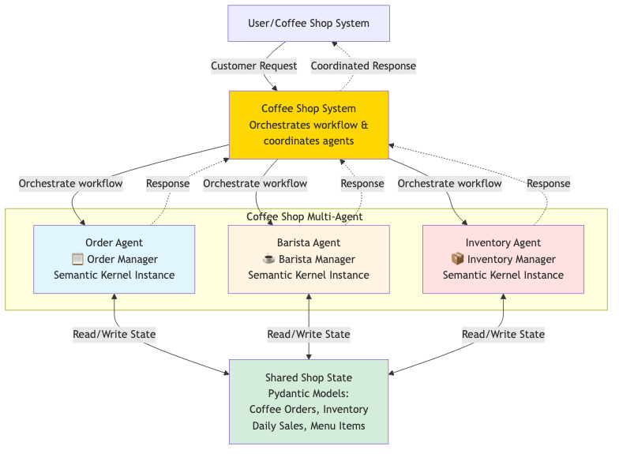

# Coffee Shop Multi-Agent System - Exercise

## 🎯 Exercise Objective
Implement a multi-agent coffee shop system that coordinates order processing, resource management, and inventory tracking using state coordination techniques.

---

## 🏗️ System Architecture

Target architecture showing the coffee shop system you'll build combining orchestration and shared state management with three agents (Order, Barista, Inventory) coordinated through a system orchestrator.

---

## 📋 Requirements

### 1. Data Models (Pydantic)
Complete the following models in `coffee_shop_starter.py`:

**CoffeeOrder**
- `order_id`: string (unique identifier)
- `customer_name`: string
- `coffee_type`: string (espresso, latte, cappuccino, americano)
- `size`: string (small, medium, large)
- `status`: string (received, preparing, brewing, ready, served)
- `order_date`: datetime

**CoffeeResource**
- `resource_id`: string
- `name`: string (espresso_machine, milk_steamer, grinder, etc.)
- `capacity`: integer
- `current_usage`: integer

**CoffeeShopState**
- `orders`: Dict of CoffeeOrder
- `resources`: Dict of CoffeeResource
- `completed_orders`: integer
- `inventory`: Dict of supplies (coffee_beans, milk, sugar, cups)

### 2. Agent Implementation
Complete three specialized agents:

**OrderAgent**
- Manages customer orders and status tracking
- Uses prompt templates to analyze order flow
- Provides order prioritization recommendations

**BaristaAgent** 
- Handles coffee preparation and resource allocation
- Manages espresso machines and other equipment
- Detects and resolves resource conflicts

**InventoryAgent**
- Tracks coffee beans, milk, and other supplies
- Provides restocking recommendations
- Monitors inventory levels

### 3. Core System Features
- **Order Processing**: Place and track coffee orders
- **Resource Management**: Allocate/release coffee machines
- **Conflict Resolution**: Handle resource contention
- **State Coordination**: Maintain consistent shared state

### 4. Demo Scenarios
Implement 5 scenarios that demonstrate:
- Order management under load
- Resource conflict detection and resolution
- Inventory management
- Performance optimization
- Process improvement

## 🛠️ Implementation Steps

1. **Complete Pydantic Models** (15 minutes)
   - Add all required fields with proper validation
   - Implement status tracking logic

2. **Implement Base Agent Class** (15 minutes)
   - Set up AzureChatCompletion service
   - Create proper initialization

3. **Build Specialized Agents** (30 minutes)
   - OrderAgent with order management
   - BaristaAgent with resource coordination  
   - InventoryAgent with supply tracking

4. **Create Main System** (20 minutes)
   - Initialize resources and state
   - Implement order processing flow
   - Add state display methods

5. **Run Demo Scenarios** (10 minutes)
   - Test all 5 scenarios
   - Verify state coordination works

## ✅ Success Criteria

- All 5 demo scenarios execute without errors
- Resource conflicts are properly detected and resolved
- Order status flows correctly through all stages
- Inventory levels are properly tracked
- State remains consistent across all agents

## 💡 Tips

- Start with simple resource allocation (no conflicts)
- Add conflict detection after basic flow works
- Use the pasta factory example as reference
- Test each agent independently first
- Use meaningful resource names (espresso_machine_1, etc.)

## 🚀 Getting Started

1. Ensure you have Azure OpenAI credentials in your `.env` file
2. Install required packages: `semantic-kernel`, `pydantic`, `python-dotenv`
3. Complete the TODO sections in the starter code
4. Run your implementation: `python coffee_shop_starter.py`

Good luck! ☕