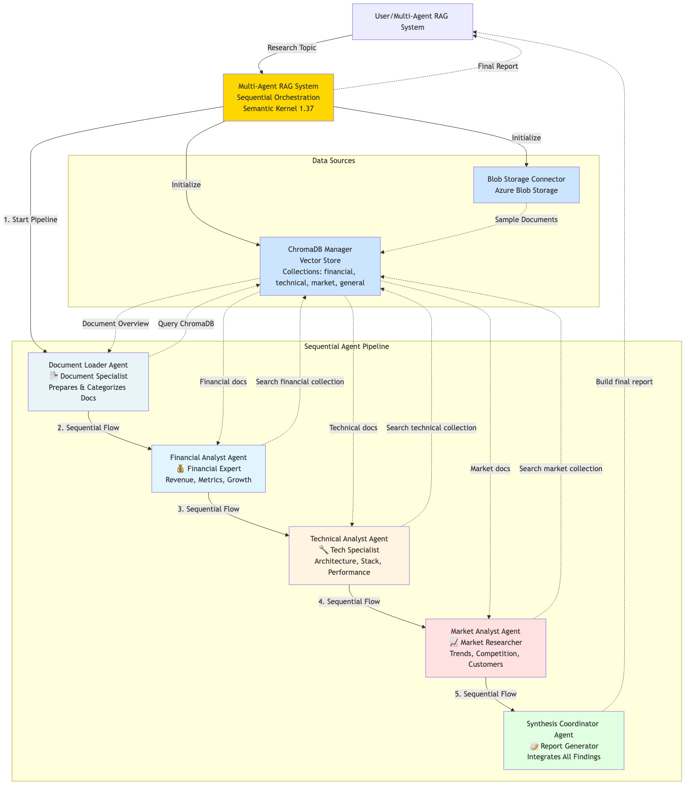

# Multi-Agent RAG System with ChromaDB & Azure Blob Storage

## 🚀 Overview

A sophisticated multi-agent Retrieval-Augmented Generation (RAG) system that leverages specialized AI agents to perform comprehensive research and analysis across multiple domains. This system combines the power of semantic search, Azure cloud services, and coordinated AI agents to deliver actionable business intelligence.

## ✨ Key Features

- **🤖 Multi-Agent Architecture**: Three specialized agents (Financial, Technical, Market) working in parallel
- **🔍 Semantic Search**: ChromaDB vector store for intelligent document retrieval
- **☁️ Cloud Integration**: Azure Blob Storage for document management and Azure OpenAI for analysis
- **📊 Comprehensive Reporting**: Synthesis agent that integrates findings into actionable reports
- **⚡ Parallel Processing**: Asynchronous execution for optimal performance
- **📈 Performance Metrics**: Detailed analytics on retrieval effectiveness and agent performance

---

## 🏗️ System Architecture



Multi-agent RAG system with three retrieval agents (Financial, Technical, Market) and synthesis agent, using ChromaDB for vector search and Azure Blob Storage for document management.

### Detailed Architecture

```
┌─────────────────┐    ┌──────────────────┐    ┌─────────────────┐
│   Azure Blob    │    │   Multi-Agent    │    │   ChromaDB      │
│   Storage       │◄──►│   RAG System     │◄──►│   Vector Store  │
│                 │    │                  │    │                 │
│ • Document      │    │ • Financial      │    │ • Semantic      │
│   Repository    │    │   Agent          │    │   Search        │
│ • Sample        │    │ • Technical      │    │ • Document      │
│   Documents     │    │   Agent          │    │   Embeddings    │
└─────────────────┘    │ • Market Agent   │    └─────────────────┘
                       │ • Synthesis      │
                       │   Agent          │     ┌─────────────────┐
                       └──────────────────┘     │   Azure OpenAI  │
                                                │                 │
                                                │ • GPT-4         │
                                                │ • Analysis      │
                                                │ • Synthesis     │
                                                └─────────────────┘
```

## 🎯 Specialized Agents

### 1. **Financial Analyst Agent**
- **Focus**: Revenue, profit margins, growth metrics, financial risks
- **Documents**: Financial reports, earnings statements, investment analysis
- **Output**: Financial performance insights and strategic recommendations

### 2. **Technical Analyst Agent**  
- **Focus**: System architecture, technology stack, performance metrics
- **Documents**: Technical specifications, architecture diagrams, API docs
- **Output**: Technical assessments and improvement recommendations

### 3. **Market Analyst Agent**
- **Focus**: Market trends, competitive landscape, customer insights
- **Documents**: Market research, competitive analysis, industry reports
- **Output**: Market intelligence and growth opportunities

### 4. **Synthesis Coordinator Agent**
- **Role**: Integrates findings from all specialized agents
- **Output**: Comprehensive research reports with executive summaries

## 📋 Prerequisites

### Required Services
- **Azure Account** with:
  - Azure Blob Storage
  - Azure OpenAI Service (GPT-4o-mini deployment)
- **Python 3.8+**

### Environment Variables
Create a `.env` file with:
```env
# Azure Blob Storage
BLOB_CONNECTION_STRING=your_blob_connection_string
BLOB_CONTAINER_NAME=rag-documents

# Azure OpenAI
AZURE_TEXTGENERATOR_DEPLOYMENT_NAME=gpt-4o-mini
AZURE_TEXTGENERATOR_DEPLOYMENT_ENDPOINT=your_azure_openai_endpoint
AZURE_TEXTGENERATOR_DEPLOYMENT_KEY=your_azure_openai_key
```

## 🛠️ Installation & Setup

1. **Clone the repository**
```bash
git clone <repository-url>
cd multi-agent-rag-demo
```

2. **Install dependencies**
```bash
pip install -r requirements.txt
```

3. **Configure environment**
```bash
cp .env.example .env
# Edit .env with your Azure credentials
```

4. **Run the demo**
```bash
python main_demo.py
```

## 📁 Project Structure

```
multi-agent-rag-system/
├── main_demo.py              # Main demo execution script
├── rag_agents.py             # Multi-agent RAG system implementation
├── blob_connector.py         # Azure Blob Storage integration
├── chroma_manager.py         # ChromaDB vector store management
├── requirements.txt          # Python dependencies
└── README.md                 # This file
```

## 🎮 Usage

### Running the Complete Demo
The system automatically processes multiple research topics:

```python
research_topics = [
    "Company growth strategy and financial performance",
    "Technical architecture and AI platform development", 
    "Market competition and customer analysis",
    "Product roadmap and future initiatives"
]
```

### Custom Research Queries
Modify `main_demo.py` to add your own research topics:

```python
custom_topics = [
    "Your custom research topic here",
    "Another specific business question"
]
```

## 📊 Sample Output

### Agent Retrieval Results
```
🤖 Deploying 3 specialized agents with semantic search...

Financial Analyst:
  📄 Documents Found: 2
  🔍 Retrieval Method: semantic_search  
  🔗 Sources: financial_report_2024.md, product_roadmap.md
  📈 Average Relevance: 0.85

Technical Analyst:
  📄 Documents Found: 1
  🔍 Retrieval Method: semantic_search
  🔗 Sources: technical_spec_ai_platform.md
  📈 Average Relevance: 0.92
```

### Comprehensive Research Report
```
🎯 COMPREHENSIVE RESEARCH REPORT
Report ID: 890ecc6b
Topic: Company growth strategy and financial performance

📋 EXECUTIVE SUMMARY:
The company shows strong 15% YoY revenue growth with healthy profit margins...
Revenue: $2.3 billion, Profit Margin: 22%, Market Cap: $15.6 billion

🔍 KEY FINDINGS:
• Solid financial performance with 15% revenue growth
• Technical architecture supports 1M+ concurrent users  
• Market shows 45% YoY AI adoption growth

💡 RECOMMENDATIONS:
• Invest in European market expansion
• Enhance AI platform capabilities
• Monitor competitive landscape
```

## 🔧 Configuration Options

### Document Chunking (chroma_manager.py)
```python
chunk_size = 500      # Characters per chunk
overlap = 50          # Overlap between chunks
```

### Search Parameters (rag_agents.py)
```python
n_results = 5         # Documents per agent search
collection_names = ["financial", "technical", "market"]  # Collections to search
```

### Agent Specialization
Each agent can be customized with:
- Domain-specific search terms
- Custom analysis prompts  
- Specialized output formats

## 🚀 Performance Features

### Parallel Processing
- All three specialized agents run concurrently
- Asynchronous document retrieval and analysis
- Optimized API calls to Azure OpenAI

### Intelligent Caching
- ChromaDB vector store for fast semantic search
- Azure Blob Storage for document persistence
- System state management for session consistency

### Quality Metrics
- Relevance scoring (0-1 scale)
- Document retrieval statistics
- Agent performance tracking
- Source attribution and verification

## 🛠️ Troubleshooting

### Common Issues

1. **Missing Environment Variables**
   ```
   ❌ Missing environment variables: AZURE_TEXTGENERATOR_DEPLOYMENT_KEY
   ```
   **Solution**: Verify your `.env` file contains all required variables.

2. **ChromaDB Connection Issues**
   ```
   Error: Unable to connect to ChromaDB
   ```
   **Solution**: Ensure ChromaDB is properly installed and accessible.

3. **Azure Blob Storage Permissions**
   ```
   Error: Unable to access blob container
   ```
   **Solution**: Verify your connection string and container permissions.

### Debug Mode
Enable detailed logging by modifying the logging configuration in `main_demo.py`:

```python
logging.getLogger('semantic_kernel').setLevel(logging.DEBUG)
logging.getLogger('azure').setLevel(logging.DEBUG)
```

## 📈 Extension Opportunities

### Additional Agents
- **Legal Analyst**: Contract and compliance analysis
- **HR Analyst**: Workforce and talent management insights
- **Operations Analyst**: Process efficiency and optimization

### Enhanced Features
- **Real-time Data Integration**: Live market data feeds
- **Multi-modal Analysis**: Image and video content processing
- **Custom Domain Adaptation**: Industry-specific fine-tuning
- **API Endpoints**: RESTful API for integration with other systems