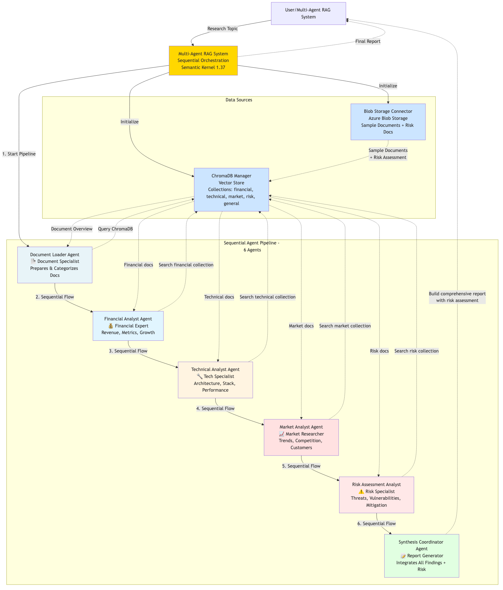

# Multi-Agent RAG System with Competitive Intelligence

## 🚀 Enhanced Multi-Agent RAG System

A sophisticated multi-agent Retrieval-Augmented Generation system that now includes **Competitive Intelligence** capabilities, providing comprehensive business intelligence across financial, technical, market, and competitive domains.

---

## 🏗️ System Architecture



Enhanced RAG system with four retrieval agents (Financial, Technical, Market, Competitive Intelligence) and synthesis agent for comprehensive research analysis, integrated with ChromaDB and Azure Blob Storage.

---

## 📋 System Workflow

### 🔄 Complete Data Flow

```
1. DOCUMENT INGESTION
   ↓
2. VECTOR EMBEDDING & STORAGE
   ↓  
3. MULTI-AGENT PARALLEL PROCESSING
   ↓
4. DOMAIN-SPECIFIC ANALYSIS
   ↓
5. CROSS-DOMAIN SYNTHESIS
   ↓
6. ACTIONABLE INTELLIGENCE REPORTS
```

## 🏗️ Detailed Workflow

### Phase 1: Document Processing Pipeline

#### Step 1.1: Document Ingestion
```python
# Documents are loaded from Azure Blob Storage
documents = [
    "financial_report_2024.md",
    "technical_spec_ai_platform.md", 
    "market_analysis_q1.md",
    "product_roadmap.md",
    "competitive_analysis_2024.md"  # 🆕 New competitive document
]
```

#### Step 1.2: Intelligent Classification & Chunking
```python
# System automatically classifies documents by domain
document → ChromaDB Collection:
- Financial documents → "financial" collection
- Technical documents → "technical" collection  
- Market research → "market" collection
- Competitive analysis → "market" collection  # 🆕 Competitive docs
```

#### Step 1.3: Vector Embedding Storage
```python
# Documents are chunked and embedded for semantic search
chunk_document(content, chunk_size=500, overlap=50)
→ Store in ChromaDB with metadata
→ Enable fast, intelligent retrieval
```

### Phase 2: Multi-Agent Analysis Engine

#### Step 2.1: Parallel Agent Deployment
```python
# Four specialized agents deploy simultaneously
agents = {
    "financial": FinancialRetrievalAgent(...),
    "technical": TechnicalRetrievalAgent(...), 
    "market": MarketRetrievalAgent(...),
    "competitive": CompetitiveIntelligenceAgent(...)  # 🆕 New agent
}
```

#### Step 2.2: Domain-Specific Semantic Search
**Financial Agent**: Searches "financial" collection for revenue, profit, growth metrics  
**Technical Agent**: Searches "technical" collection for architecture, performance data  
**Market Agent**: Searches "market" collection for trends, customer insights  
**Competitive Agent**: 🆕 Searches "market" collection for competitor analysis, market share

#### Step 2.3: Intelligent Document Retrieval
```python
# Each agent performs semantic search
search_results = chroma_manager.semantic_search(
    query=research_topic,
    collection_names=["respective_collection"],
    n_results=5
)
```

#### Step 2.4: Domain Expertise Analysis
Each agent applies specialized AI analysis:

- **Financial Analyst**: 
  ```python
  "Analyze revenue trends, profit margins, financial risks"
  → Output: Financial performance insights
  ```

- **Technical Analyst**:
  ```python
  "Evaluate architecture, scalability, technical capabilities"  
  → Output: Technical assessment
  ```

- **Market Analyst**:
  ```python
  "Study market trends, customer behavior, industry dynamics"
  → Output: Market intelligence
  ```

- **Competitive Intelligence Analyst**: 🆕
  ```python
  "Analyze competitive landscape, market positioning, competitor strengths"
  → Output: Competitive strategy recommendations
  ```

### Phase 3: Cross-Domain Synthesis

#### Step 3.1: Agent Results Integration
```python
# Synthesis agent receives analysis from all four agents
agent_results = [
    financial_analysis,
    technical_analysis, 
    market_analysis,
    competitive_analysis  # 🆕 Now includes competitive insights
]
```

#### Step 3.2: Intelligent Synthesis Process
```python
# Synthesis prompt combines all domain perspectives
prompt = """
Combine insights from:
- Financial performance data
- Technical capabilities  
- Market trends
- Competitive landscape  # 🆕 New competitive dimension

Generate integrated recommendations...
"""
```

#### Step 3.3: Comprehensive Report Generation
The synthesis agent creates reports that connect insights across all domains:

```
EXECUTIVE SUMMARY:
• Financial: 15% revenue growth, strong margins
• Technical: Scalable architecture supporting 1M+ users  
• Market: 45% AI adoption growth
• Competitive: 🆕 15% market share, key differentiators

INTEGRATED RECOMMENDATIONS:
1. Leverage technical strengths for competitive advantage
2. Target growth segments identified in market analysis
3. Address competitive threats with strategic positioning
```

## 🎯 Enhanced Agent Capabilities

### Financial Analyst Agent
**Focus Areas**: Revenue analysis, profit margins, growth metrics, financial risks  
**Key Outputs**: Financial performance insights, investment recommendations  
**Sample Insight**: "Revenue: $2.3B (15% YoY growth), Profit Margin: 22%"

### Technical Analyst Agent  
**Focus Areas**: System architecture, performance metrics, scalability, security  
**Key Outputs**: Technical assessments, improvement recommendations  
**Sample Insight**: "Microservices architecture supports 1M+ concurrent users"

### Market Analyst Agent
**Focus Areas**: Market trends, customer segmentation, industry analysis  
**Key Outputs**: Market intelligence, growth opportunities  
**Sample Insight**: "45% YoY AI adoption growth, strong mobile demand"

### 🆕 Competitive Intelligence Analyst Agent
**Focus Areas**: Competitive landscape, market positioning, competitor analysis  
**Key Outputs**: Competitive threats/opportunities, strategic positioning  
**Sample Insight**: "15% market share, key differentiators in AI capabilities"

## 📊 Sample Research Workflow

### Research Topic: "Competitive Landscape and Market Positioning"

#### Step 1: Multi-Agent Retrieval
```
🤖 Deploying 4 specialized agents...

Financial Analyst: 2 documents found
Technical Analyst: 1 document found  
Market Analyst: 1 document found
Competitive Intelligence Analyst: 🆕 1 document found
```

#### Step 2: Domain Analysis
```python
# Competitive Agent Analysis
"Market Share: TechCorp (35%), Innovate Solutions (25%), Our Company (15%)
 Competitive Threats: Price erosion, new market entrants
 Strategic Recommendations: Differentiate through AI capabilities"
```

#### Step 3: Integrated Synthesis
```python
# Synthesis connects competitive position with capabilities
"While holding 15% market share, our technical AI capabilities provide 
key differentiation against larger competitors. Financial strength 
supports aggressive market expansion to capture growth opportunities."
```

## 🚀 Running the Enhanced System

### Quick Start
```bash
# 1. Set up environment
cp .env.example .env
# Add Azure credentials

# 2. Install dependencies
pip install -r requirements.txt

# 3. Run enhanced demo
python main_demo.py
```

### Research Topics Processed
```python
research_topics = [
    "Company growth strategy and financial performance",
    "Technical architecture and AI platform development",
    "Market competition and customer analysis", 
    "Product roadmap and future initiatives",
    "Competitive landscape and market positioning"  # 🆕 New topic
]
```

## 📈 Enhanced Output Example

### Before (3 Agents)
```
EXECUTIVE SUMMARY:
Financial performance strong with 15% growth.
Technical architecture scalable.
Market trends positive.
```

### After (4 Agents) 🆕
```
EXECUTIVE SUMMARY:
Financial: 15% revenue growth with strong margins
Technical: Scalable architecture supporting enterprise growth
Market: 45% AI adoption creating expansion opportunities  
Competitive: 🆕 15% market share with AI differentiation advantage

KEY RECOMMENDATIONS:
• Leverage AI technical capabilities for competitive positioning
• Target enterprise segment where we have competitive advantage
• Monitor TechCorp's pricing strategy in SMB segment
```

## 🔧 Technical Architecture

### Enhanced Agent Coordination
```
Research Query
    ↓
Parallel Processing:
├── Financial Agent → Financial Insights
├── Technical Agent → Technical Assessment  
├── Market Agent → Market Intelligence
└── Competitive Agent → 🆕 Competitive Analysis
    ↓
Synthesis Agent → Integrated Business Intelligence
```

### Data Flow Enhancement
```
Azure Blob Storage
    ↓
ChromaDB Vector Store
    ↓
Multi-Agent Retrieval (4 agents) 🆕 +1 agent
    ↓  
Azure OpenAI Analysis
    ↓
Cross-Domain Synthesis
    ↓
Comprehensive Business Reports
```

## 🎯 Business Value Added

### With Competitive Intelligence Agent
1. **Complete Market View**: Financial + Technical + Market + Competitive perspectives
2. **Strategic Positioning**: Understand competitive advantages and threats
3. **Informed Decision Making**: Comprehensive intelligence for business strategy
4. **Proactive Planning**: Anticipate competitive moves and market shifts

### Use Cases Enhanced
- **Strategic Planning**: Complete competitive landscape analysis
- **Product Development**: Technical capabilities vs. competitor offerings  
- **Market Expansion**: Competitive threats in new segments
- **Investment Decisions**: Financial strength relative to competitors

## 📝 Key Features

### ✅ Original Capabilities
- Multi-agent parallel processing
- Semantic search with ChromaDB
- Azure Blob Storage integration
- Domain-specific analysis
- Automated report generation

### 🆕 Enhanced Capabilities
- **Competitive Intelligence**: Market share analysis, competitor profiling
- **Complete Business View**: Four-domain comprehensive analysis
- **Strategic Recommendations**: Competitive positioning guidance
- **Threat Identification**: Early warning for competitive moves

---

**🚀 Transform information into competitive advantage with complete multi-domain business intelligence!**