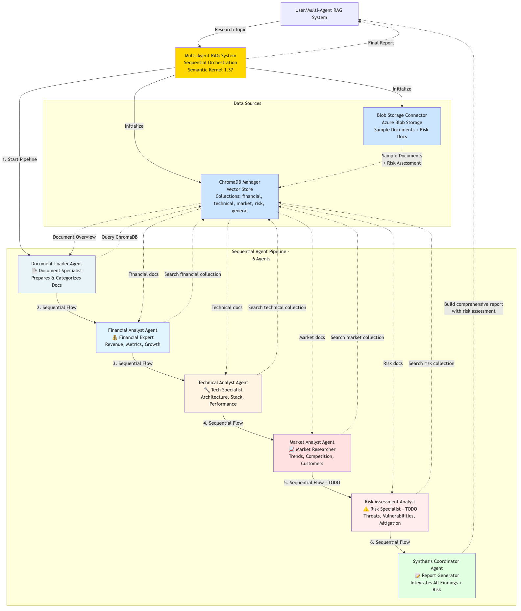

# 🎯 Exercise Instructions

## 🏗️ Target System Architecture

Target architecture showing the multi-agent RAG system you'll build with retrieval agents (Financial, Technical, Market, Competitive Intelligence), synthesis agent, and vector database integration with ChromaDB and Azure Blob Storage.

---

## Step 1: Implement the Competitive Intelligence Agent
- Complete the `CompetitiveIntelligenceAgent` class in **rag_agents.py**  
- Follow the patterns from existing agents  
- Focus on **competitive analysis** and **market positioning**

---

## Step 2: Integrate the New Agent
- Add the agent to `MultiAgentRAGSystem` in **main_demo.py**  
- Add appropriate **research topics**

---

## Step 3: Add Sample Data
- Include **competitive intelligence documents** in **blob_connector.py**

---

## Step 4: Test the System
- Run the demo and verify the new agent works  
- Check that **competitive insights** appear in the reports

---

# 📚 Learning Outcomes
After completing this exercise, you'll understand:

- How to extend **multi-agent systems** with new capabilities  
- The pattern for creating **specialized RAG agents**  
- **Document classification** and **analysis techniques**  
- **System integration patterns** for AI agents

---

**⏱️ Time to complete:** 30–45 minutes  
**💪 Difficulty:** Beginner–Intermediate  
**🧠 Skills practiced:** Python, AI Agents, RAG Systems, System Design
